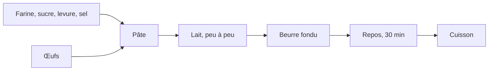

# Gaufres

*Pour 8 gaufres, 10 minutes de préparation, 30 minutes de repos.*

## Ingrédients

## Préparation

1. Mélanger la farine, le sucre, la levure et le sel dans un saladier.
2. Creuser un puits au centre, y casser les œufs et mélanger.
3. Verser le lait **peu à peu**, sans cesser de remuer.
4. Ajouter le beurre fondu.
5. Laisser reposer la pâte 30 minutes.
6. Cuire dans un gaufrier chaud, trois minutes par gaufre.

> Les gaufres se servent chaudes, avec du sucre glace.
