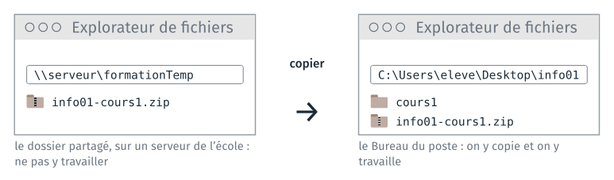

*Version 2 du cours 1 : proposition de travail pour 2027-2028. Ce guide
reprend celui du TD 1a du cours 1 de 2026 ; le renommage des extensions et
l'espace dans un nom de fichier passent au TD 2a, en ligne de commande, et la
table ASCII au cours 3.*

Le TD commence par copier les fichiers de la séance sur le poste. Il manipule
ensuite les fichiers d'un même texte, le poème *The Raven* d'Edgar Allan Poe
(1845), sous plusieurs formes : un document LibreOffice, un fichier texte,
deux pages web. On les exporte et on les ouvre avec différents logiciels,
pour comparer ce que décide l'extension et ce que contient le fichier. Il
dure un quart d'heure.

Tout se fait avec l'explorateur de fichiers, LibreOffice, un navigateur et
deux éditeurs de texte, le Bloc-notes et Notepad++. Aucune commande n'est
nécessaire.

Le dossier `depart\` contient aussi les mêmes fichiers pour un second texte,
*Auld Lang Syne* de Robert Burns (1788). Qui a fini en avance peut refaire
les étapes avec lui.

| Étape | Ce qu'on fait |
|---|---|
| 1 | copier les fichiers de la séance sur le poste |
| 2 | préparer le dossier du TD |
| 3 | exporter un même document en trois formats |
| 4 | ouvrir une page web depuis son disque |
| 5 | lire les fichiers avec deux éditeurs de texte |

Chaque étape commence par un encadré qui la résume. Ce que chaque étape fait
constater est expliqué à la fin du guide, dans « Ce que le TD fait
constater » : faire l'étape d'abord, et noter ce qu'on observe, avant de lire
l'explication.

## 1 · Copier les fichiers de la séance sur le poste

> **À faire :** ouvrir le dossier partagé `formationTemp` ; copier l'archive
> `info01-cours1.zip` dans le dossier `info01` du Bureau ; l'extraire dans
> ce même dossier.
>
> **À obtenir :** le dossier `C:\Users\eleve\Desktop\info01` contient
> l'archive et le dossier `cours1`.

### Deux emplacements

Avant la séance, l'archive est déposée dans le dossier partagé
`formationTemp`, sur un serveur de l'école. Il faut la copier sur le poste,
puis la décompresser, avant d'ouvrir le premier fichier.



Ne pas travailler dans le dossier partagé. `formationTemp` est le même
dossier pour tous les élèves. Un fichier enregistré là est visible par tous,
et il peut être écrasé par un autre élève, ou effacé avant la séance
suivante.

Avant d'ouvrir un fichier, regarder la barre d'adresse de l'explorateur :
elle doit commencer par `C:\Users\eleve\Desktop\info01`. Si elle commence
par `\\` ou par une autre lettre que `C:`, on est dans le dossier partagé.

### Copier l'archive dans un dossier du Bureau

1. Sur le Bureau, double-cliquer sur le raccourci `formationTemp`.
2. Windows demande un nom d'utilisateur et un mot de passe : entrer ses
   identifiants d'élève [à compléter : les mêmes que pour la session
   réseau ?].
3. Le dossier s'ouvre dans l'explorateur de fichiers. Il contient l'archive
   de la séance, `info01-cours1.zip`.
4. La première fois : sur le Bureau, clic droit sur un endroit vide,
   Nouveau, Dossier, et le nommer `info01`.
5. Dans `formationTemp`, clic droit sur `info01-cours1.zip`, Copier (ou
   `Ctrl` + `C`).
6. Ouvrir le dossier `info01` du Bureau, clic droit sur un endroit vide,
   Coller (ou `Ctrl` + `V`). La copie prend quelques secondes.
7. Fermer la fenêtre de `formationTemp`. Tout ce qui suit se fait dans
   `info01`.

L'explorateur affiche le Bureau sous le nom « Bureau ». Son nom réel,
celui qu'on lit dans un chemin ou dans un terminal, est `Desktop`.

**Vérification** : dans `formationTemp`, la barre d'adresse commence par
`\\` ; dans `info01`, elle indique `C:\Users\eleve\Desktop\info01`.

### Décompresser l'archive

Un fichier `.zip` est un seul fichier, qui contient des dossiers et des
fichiers compressés. L'explorateur de Windows l'affiche comme un dossier :
un double-clic l'ouvre, et montre son contenu. Ce n'est pas un dossier :

- un fichier ouvert par double-clic depuis l'archive est d'abord extrait
  dans un dossier temporaire ; ce qu'on y enregistre reste dans ce dossier
  temporaire, et il est perdu à la fermeture ;
- VS Code, JupyterLab et Spyder n'ouvrent pas un dossier qui est dans un
  `.zip`. Dans leur fenêtre « Ouvrir un dossier », l'archive est un
  fichier, et on ne peut pas entrer dedans.

Il faut donc extraire l'archive, une fois, avant de commencer :

1. Dans `info01`, clic droit sur `info01-cours1.zip`, « Extraire tout… ».
2. Une fenêtre demande le dossier de destination. Elle propose
   `C:\Users\eleve\Desktop\info01\info01-cours1`. Effacer la fin,
   `\info01-cours1`, pour laisser `C:\Users\eleve\Desktop\info01`.
   L'archive contient déjà un dossier `cours1` ; sans cette correction, on
   obtient `info01\info01-cours1\cours1`, un dossier de trop, et les
   chemins des diapositives ne correspondent plus.
3. Laisser cochée « Afficher les fichiers extraits une fois l'opération
   terminée », puis cliquer sur « Extraire ».
4. Le dossier `cours1` s'ouvre. Il contient un dossier par TD, numéroté
   dans l'ordre de la séance (`1a_formats`, `2a_terminal`…), avec dans
   chacun la feuille du TD en PDF, et un fichier `README.md` qui liste les
   TD.

Dans `info01`, il y a maintenant l'archive `info01-cours1.zip`, avec une
icône de fermeture éclair, et le dossier `cours1`, avec une icône de
dossier. Tout le travail se fait dans le dossier `cours1`. L'archive peut
être supprimée, ou gardée pour refaire un TD depuis ses fichiers de départ.
Pour voir l'extension `.zip` dans le nom, l'explorateur doit afficher les
extensions (étape 2).

La page « Récupérer les fichiers d'une séance » du site du cours détaille
ces opérations, et ce qu'on fait du dossier `info01` à la fin de la séance.

**Vérification** : `cours1` apparaît à côté de l'archive, dans `info01`.

## 2 · Préparer le dossier du TD

> **À faire :** afficher les extensions dans l'explorateur ; ouvrir le
> dossier `cours1\1a_formats\`.
>
> **À obtenir :** l'explorateur montre `depart\` et `travail\`, et les noms
> de fichiers se terminent par leur extension (`raven.odt`, pas `raven`).

### Afficher les extensions

Windows masque par défaut les extensions des types de fichiers qu'il connaît.
Dans l'explorateur : menu Affichage, Afficher, cocher « Extensions de noms de
fichiers ». Sous macOS : Finder, Réglages, Avancé, « Afficher tous les
suffixes de fichiers ». Le réglage se fait une fois, et sert tout le
semestre.

### Les deux dossiers du TD

Ouvrir `info01\cours1\1a_formats\`. Le dossier contient :

```text
1a_formats\
├── depart\
│   ├── raven.odt                  le poème, document LibreOffice
│   ├── raven_une_ligne.txt        le poème, en texte sur une seule ligne
│   ├── raven_une_ligne.donnees    le même fichier, avec une autre extension
│   ├── raven_brut.html            le poème, en page web sans mise en forme
│   ├── raven_style.html           la même page, avec une feuille de style
│   ├── style.css                  la feuille de style
│   └── auld_lang_syne…            les mêmes fichiers pour le second texte
├── travail\                       vide
├── td_1a_formats.pdf              la feuille du TD
└── README.md
```

`depart\` contient les fichiers fournis, et ne se modifie pas. `travail\`
reçoit les copies et ce que le TD fabrique. Si une copie est abîmée, on en
refait une à partir de `depart\`.

Le chemin complet d'un fichier de départ, et celui d'un fichier exporté,
sont :

```text
C:\Users\eleve\Desktop\info01\cours1\1a_formats\depart\raven.odt
C:\Users\eleve\Desktop\info01\cours1\1a_formats\travail\raven.pdf
```

La suite du guide écrit les chemins à partir de `1a_formats\`.

**Vérification** : la barre d'adresse de l'explorateur se termine par
`cours1\1a_formats` (ou « Bureau > info01 > cours1 > 1a_formats »), et
`depart\` montre `raven.odt` avec son extension.

## 3 · Exporter un même document en trois formats

> **À faire :** ouvrir `depart\raven.odt` dans LibreOffice Writer ;
> l'exporter en PDF puis en PNG dans `travail\` ; rouvrir les trois fichiers.
>
> **À obtenir :** `travail\` contient `raven.pdf` et `raven.png`.

Double-cliquer sur `depart\raven.odt` : LibreOffice Writer l'ouvre.

1. Menu Fichier, Exporter au format PDF, puis Exporter. Enregistrer dans
   `travail\` sous le nom `raven.pdf`.
2. Menu Fichier, Exporter…, choisir le type PNG. Enregistrer dans `travail\`
   sous le nom `raven.png`. L'export en image est dans « Exporter », pas dans
   « Enregistrer sous ».
3. Fermer LibreOffice sans enregistrer le `.odt`.

Rouvrir ensuite les trois fichiers, et essayer dans chacun de sélectionner
une ligne du poème, puis de chercher un mot avec `Ctrl` + `F`. Le `.png`
s'ouvre dans une visionneuse d'images ; ouvert depuis LibreOffice, il
s'affiche dans Draw, comme une image posée sur une page.

**À noter** : pour chacun des trois fichiers, si le texte est encore du texte
(il se sélectionne, se cherche, se modifie).

## 4 · Ouvrir une page web depuis son disque

> **À faire :** ouvrir `depart\raven_brut.html` puis `depart\raven_style.html`
> dans le navigateur ; modifier une couleur dans `style.css` ; lire
> l'adresse de la page.
>
> **À obtenir :** la page mise en forme change de couleur après `F5`.

### Deux pages, une feuille de style

1. Double-cliquer sur `depart\raven_brut.html`. Le navigateur l'ouvre, sans
   réseau.
2. Double-cliquer sur `depart\raven_style.html` : le même texte, mis en
   forme.
3. Ouvrir les deux fichiers dans le Bloc-notes (clic droit, Ouvrir avec,
   Bloc-notes) et comparer leur en-tête, entre `<head>` et `</head>`, puis
   la façon dont le poème est écrit.
4. Ouvrir `depart\style.css` dans le Bloc-notes. Remplacer la valeur d'une
   ligne `color:` par `crimson`, ou par un code comme `#c0392b`, et
   enregistrer.
5. Revenir au navigateur sur `raven_style.html`, et recharger la page avec
   `F5`.

`style.css` est le seul fichier de `depart\` que le TD modifie : remettre
sa couleur d'origine à la fin de l'étape.

### L'adresse de la page

Lire l'adresse que le navigateur affiche pour `raven_style.html`. Elle a la
forme :

```text
file:///C:/Users/eleve/Desktop/info01/cours1/1a_formats/depart/raven_style.html
```

**À noter** : ce qui ressemble à un chemin de fichier dans cette adresse, et
ce qui en diffère. Noter aussi ce qui distingue les deux fichiers HTML dans
le Bloc-notes.

## 5 · Lire les fichiers avec deux éditeurs de texte

> **À faire :** ouvrir quatre fichiers de `depart\` dans le Bloc-notes, puis
> dans Notepad++.
>
> **À obtenir :** les quatre fichiers ouverts dans chaque éditeur, puis
> fermés sans enregistrer.

Ouvrir chacun des quatre fichiers suivants dans le Bloc-notes (clic droit,
Ouvrir avec, Bloc-notes), puis dans Notepad++ (clic droit, Ouvrir avec,
Notepad++, ou par le menu Fichier de Notepad++) :

| Fichier, dans `depart\` | Dans le Bloc-notes | Dans Notepad++ |
|---|---|---|
| `raven_une_ligne.txt` | | |
| `style.css` | | |
| `raven_brut.html` | | |
| `raven.odt` | | |

**Attention** : ne rien enregistrer, et fermer sans sauver. Un `.odt`
réenregistré par un éditeur de texte est détruit.

**À noter** : pour chaque fichier et chaque éditeur, si le contenu est
lisible, et ce que Notepad++ ajoute à l'affichage.

## Ce que le TD fait constater

Cette section se lit après avoir fait les étapes.

### Étape 3 : trois formats d'un même document

| Fichier | Le texte est-il encore du texte ? |
|---|---|
| `raven.odt` | oui, et il reste modifiable dans LibreOffice |
| `raven.pdf` | oui : il se sélectionne et se cherche, mais la mise en page est figée |
| `raven.png` | non : ce sont des pixels, et seule la première page est exportée |

Un PDF décrit la page : les caractères y sont rangés avec leur position. Une
image PNG ou JPEG photographie la page : elle ne garde que l'apparence, et
le texte n'y est plus que des points de couleur.

### Étape 4 : une page web, son style, son adresse

`raven_brut.html` et `raven_style.html` contiennent le même poème. Dans
`raven_brut.html`, il tient dans un seul paragraphe, `<p>`, et le navigateur
l'affiche en un bloc : les sauts de ligne du fichier ne sont pas rendus, la
structure d'une page HTML se déclare par des balises. `raven_style.html`
écrit un paragraphe par vers, et son en-tête contient une ligne de plus,
`<link rel="stylesheet" href="style.css">`, qui appelle la feuille de style.
`style.css` décrit la présentation : couleurs, polices, largeur. Modifier `style.css` change l'apparence de la page sans
toucher au texte. Le contenu est dans un fichier, la présentation dans un
autre, et l'un change sans l'autre. CSS accepte les couleurs par leur nom
(`crimson`) comme par leur code hexadécimal (`#c0392b`), deux chiffres par
composante, rouge, vert, bleu.

Une adresse web, ou **URL**, est un chemin de fichier précédé de la machine
où aller le chercher :

| Partie | Dans `https://www.ensg.eu/cours/info01/raven.html` |
|---|---|
| le protocole, la façon convenue de demander le fichier | `https://` |
| la machine | `www.ensg.eu` |
| le chemin sur cette machine | `/cours/info01/` |
| le fichier | `raven.html` |

L'adresse d'une page ouverte depuis le disque a la même forme, avec le
protocole `file`. Entre `file://` et le chemin, la place de la machine est
vide, puisque c'est la vôtre ; la troisième barre est le début du chemin,
`/C:/`. Le navigateur écrit tous les chemins avec des `/`, même sous Windows.

### Étape 5 : ce qu'un éditeur de texte affiche

| Fichier | Dans le Bloc-notes | Dans Notepad++ |
|---|---|---|
| `raven_une_ligne.txt` | le poème, lisible en entier | le même, sans couleur |
| `style.css` | des règles, lisibles | sélecteurs et propriétés en couleur |
| `raven_brut.html` | le texte et ses balises | les balises en couleur, repliables |
| `raven.odt` | `PK`, puis des caractères sans suite : du binaire | les mêmes, et des `NUL` en surbrillance |

Un éditeur de texte affiche un caractère par octet, selon la table
d'encodage, et n'interprète rien d'autre : ni image, ni mise en forme. Ce qui
n'a pas de caractère correspondant apparaît en carré ou en signe étrange ;
Notepad++ marque `NUL` les octets de valeur `00`.

Les couleurs de Notepad++ ne viennent pas du fichier : l'éditeur les ajoute
d'après l'extension, qu'il associe à un langage. Renommer `style.css` en
`style.txt` les fait disparaître. L'éditeur de code du cours 2 fait la
même chose pour Python.

`raven_brut.html` est du texte, `raven.odt` n'en est pas, et leur nom ne le
disait pas : seule l'ouverture dans un éditeur de texte le montre. Les deux
caractères `PK` du début sont la signature d'une archive ZIP, dont un `.odt`
est une forme. Le cours 3 y revient avec la table ASCII.
