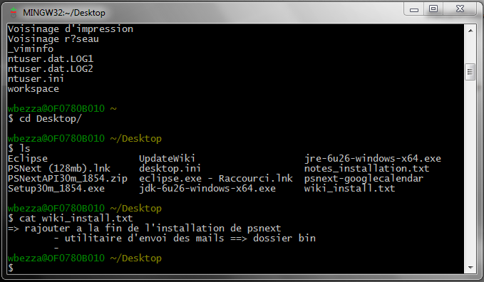
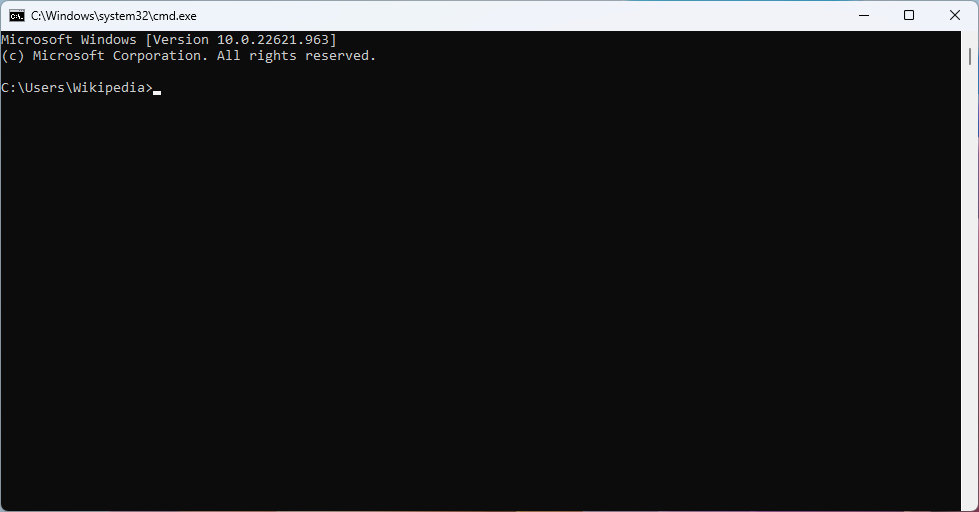
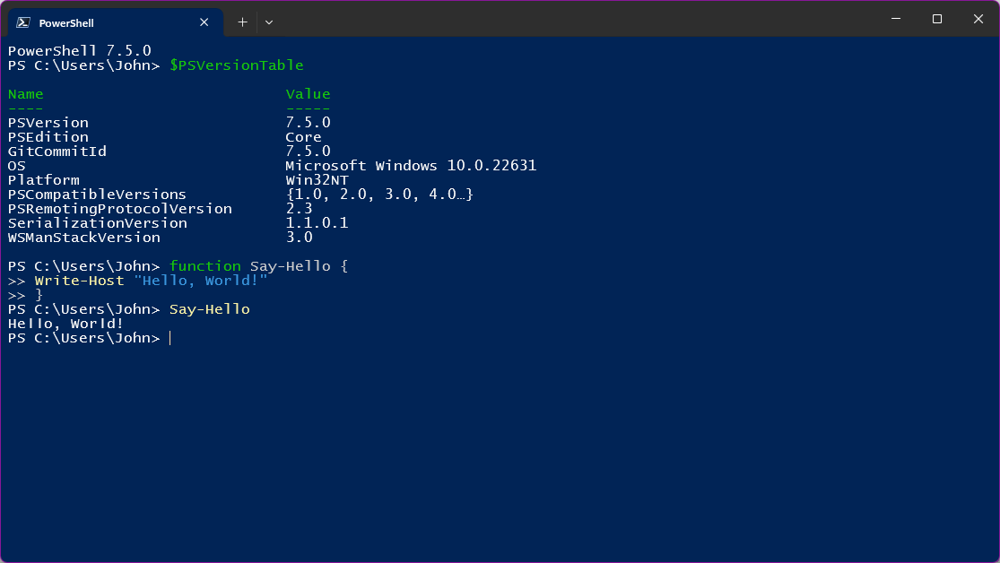
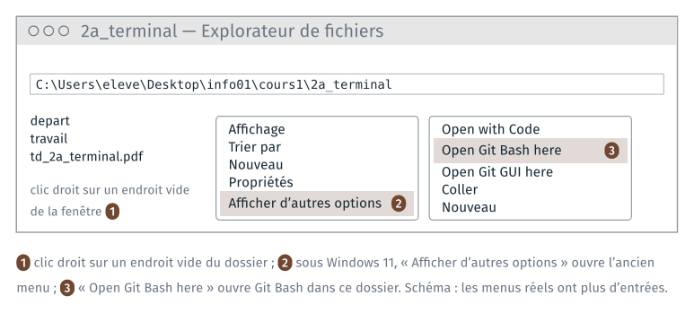
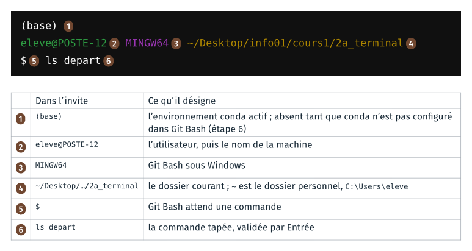
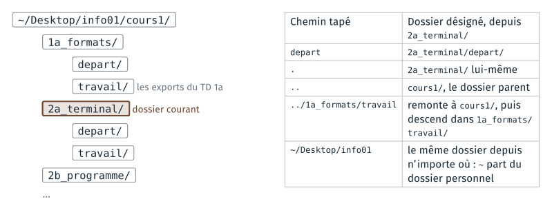

*Version 2 du cours 1 : proposition de travail pour 2027-2028. Ce TD est
nouveau : il reprend en ligne de commande une partie du TD 1a de 2026
(renommer une extension, un espace dans un nom).*

Le TD refait au clavier, dans un terminal, ce que le TD 1a a fait à la
souris : se déplacer dans les dossiers, copier, renommer et ouvrir des
fichiers. Il se termine par un réglage fait une fois par poste, qui rend
Python disponible dans le terminal. Il dure une quinzaine de minutes.

Le terminal du module est **Git Bash**, installé avec git sur les postes de
la salle. Les commandes de ce guide sont celles de bash : elles se tapent à
l'identique dans le terminal de macOS et de Linux.

| Étape | Ce qu'on fait |
|---|---|
| 1 | ouvrir Git Bash dans le dossier du TD, et lire l'invite |
| 2 | se déplacer et lister le contenu des dossiers |
| 3 | copier, renommer et ouvrir des fichiers |
| 4 | écrire un nom de fichier qui contient un espace |
| 5 | copier plusieurs fichiers d'un coup, supprimer un fichier |
| 6 | rendre Python disponible dans Git Bash, une fois par poste |

## Rappels avant de commencer

**Un terminal, plusieurs fenêtres.** Le poste a plusieurs terminaux :
l'invite de commandes (`cmd`), PowerShell, Git Bash. Chacun a son langage.
Les commandes du guide sont celles de Git Bash, et la dernière annexe donne
leurs équivalents dans les deux autres. L'invite, au début de chaque ligne,
indique le terminal employé :

| Git Bash | Invite de commandes | PowerShell |
|---|---|---|
|  |  |  |
| `utilisateur@machine MINGW64 ~/…`, puis `$` | `C:\Users\…>` | `PS C:\Users\…>` |

La capture de Git Bash date de 2011 (`MINGW32`). Sources et licences :
`images/terminaux/CREDITS.md` dans le dépôt du cours.

**Taper une commande.** Une commande se tape après le `$`, puis se valide
par `Entrée`. Deux touches font gagner du temps :

| Touche | Ce qu'elle fait |
|---|---|
| flèche vers le haut | rappelle la commande précédente, à modifier ou relancer |
| `Tab` | complète le nom de fichier ou de dossier commencé |
| `Ctrl` + `C` | interrompt la commande en cours |

Sur un clavier français : `~` se tape `AltGr` + `2`, puis espace ; `|`,
`AltGr` + `6`. Coller dans Git Bash : clic droit, puis « Paste », ou `Maj` +
`Inser` ; `Ctrl` + `V` ne colle pas.

**Une commande qui réussit n'affiche souvent rien.** `cp`, `mv`, `mkdir`,
`rm` n'affichent rien quand tout se passe bien. Un message après une de ces
commandes est un message d'erreur : le lire.

## 1 · Ouvrir Git Bash dans le dossier du TD

> **À faire :** ouvrir `cours1\2a_terminal\` dans l'explorateur ; y ouvrir Git Bash par le clic droit ; lire l'invite.
>
> **À obtenir :** une fenêtre Git Bash dont l'invite se termine par `~/Desktop/info01/cours1/2a_terminal`.

**Dossier de départ** : `cours1/2a_terminal/`, tel que décompressé au TD 1a.

```text
2a_terminal/
├── depart/        les fichiers du TD 1a : raven.odt, raven_brut.html…
├── travail/       vide
└── td_2a_terminal.pdf
```

### Ouvrir Git Bash par le clic droit

1. Dans l'explorateur, ouvrir `Bureau\info01\cours1\2a_terminal`.
2. Clic droit sur un endroit vide de la fenêtre (pas sur un fichier).
3. Sous Windows 11, choisir « Afficher d'autres options », en bas du menu.
4. Choisir « Open Git Bash here ».



Git Bash s'ouvre, et son dossier courant est le dossier où l'on a cliqué.

Autre façon : menu Démarrer, « Git Bash », puis taper

```text
cd ~/Desktop/info01/cours1/2a_terminal
```

### Lire l'invite



Sur la capture, la ligne `(base)` n'est pas encore là : elle apparaît à
l'étape 6.

**Vérification** :

```text
pwd
```

affiche le chemin absolu du dossier courant :

```text
/c/Users/eleve/Desktop/info01/cours1/2a_terminal
```

Git Bash écrit les chemins à la façon de Linux : des barres obliques `/`,
et le disque `C:` devient `/c`. Le même dossier s'écrit
`C:\Users\eleve\Desktop\info01\cours1\2a_terminal` dans l'explorateur.

## 2 · Se déplacer et lister

> **À faire :** lister le dossier courant et `depart/` ; afficher les entrées cachées ; descendre dans `depart/` et remonter ; lister un dossier d'un autre TD.
>
> **À obtenir :** l'invite suit chaque `cd` ; `ls ../1a_formats/travail` montre les exports du TD 1a.

### Lister

```text
ls
```

`ls` liste le contenu du dossier courant : `depart/`, `travail/` et les
fichiers du TD. Le `/` à la fin d'un nom marque un dossier.

```text
ls depart
```

```text
auld_lang_syne.odt                raven_brut.html
auld_lang_syne_brut.html          raven_style.html
auld_lang_syne_style.html         raven_une_ligne.donnees
auld_lang_syne_une_ligne.donnees  raven_une_ligne.txt
auld_lang_syne_une_ligne.txt      style.css
raven.odt
```

`depart` est un **argument** : le dossier à lister. Sans argument, `ls`
liste le dossier courant.

### Les entrées cachées

```text
ls travail
ls -a travail
```

`ls travail` n'affiche rien : le dossier est vide. `ls -a travail` affiche
deux entrées :

```text
./  ../
```

`-a` est une **option** : elle modifie ce que fait la commande (« all »,
tout afficher). `.` désigne le dossier lui-même, `..` son dossier parent.
Tout dossier les contient ; `ls` ne les affiche pas, parce que leur nom
commence par un point, la marque d'un fichier caché.

### Se déplacer

```text
cd depart
pwd
```

L'invite et `pwd` se terminent maintenant par `2a_terminal/depart`. `cd`
(« change directory ») change le dossier courant.

```text
cd ..
pwd
```

retour dans `2a_terminal`. Les chemins relatifs partent du dossier courant :



```text
ls ../1a_formats/travail
```

liste les fichiers exportés au TD 1a (`raven.pdf`, `raven.png`), sans
quitter `2a_terminal`.

**Vérification** : l'invite se termine par `2a_terminal`.

Si `cd` affiche `No such file or directory`, le chemin tapé n'existe pas
depuis le dossier courant : lire l'invite, puis `ls` pour voir les noms
disponibles. `Tab` complète un nom commencé et évite les fautes de frappe.

## 3 · Copier, renommer, ouvrir

> **À faire :** copier `raven.odt` dans `travail/`, le renommer en `raven_odt.pdf`, l'ouvrir par `start` ; refaire avec deux autres noms.
>
> **À obtenir :** trois copies de `raven.odt` dans `travail/`, et, pour chacune, le logiciel que Windows a lancé.

### Copier

```text
cp depart/raven.odt travail/
ls travail
```

```text
raven.odt
```

`cp source destination` copie ; la destination est ici un dossier, et la
copie garde son nom.

### Renommer

```text
mv travail/raven.odt travail/raven_odt.pdf
ls travail
```

```text
raven_odt.pdf
```

`mv` déplace ou renomme : ici, le fichier reste dans `travail/` et change de
nom. Windows demandait une confirmation quand on changeait l'extension à la
souris ; `mv` n'en affiche pas.

### Ouvrir

```text
start travail/raven_odt.pdf
```

`start` ouvre un fichier avec le logiciel que Windows associe à son
extension, comme un double-clic dans l'explorateur.

**À noter** : le logiciel lancé, et ce qu'il affiche.

Deux autres copies, et leur ouverture :

```text
cp depart/raven.odt travail/riri.fifi.loulou.odt
start travail/riri.fifi.loulou.odt
cp depart/raven.odt travail/raven.loulou
start travail/raven.loulou
```

Pour `raven.loulou`, une fenêtre de Windows demande avec quel logiciel
ouvrir le fichier : choisir LibreOffice Writer.

**À noter** : pour chaque copie, le logiciel lancé et ce qu'il affiche.

**Vérification** :

```text
ls travail
```

```text
raven.loulou  raven_odt.pdf  riri.fifi.loulou.odt
```

Si `start` ne fait rien, essayer `explorer.exe`, qui ouvre aussi un fichier
avec son logiciel associé ; les barres du chemin s'écrivent alors à la façon
de Windows : `explorer.exe travail\\raven_odt.pdf`.

## 4 · Un espace dans un nom de fichier

> **À faire :** copier `raven_brut.html` sous le nom `raven brut.html`, sans puis avec guillemets ; l'ouvrir.
>
> **À obtenir :** la copie `raven brut.html` dans `travail/`, ouverte dans le navigateur.

```text
cp depart/raven_brut.html travail/raven brut.html
```

Git Bash affiche un message d'erreur, par exemple :

```text
cp: target 'brut.html': No such file or directory
```

Git Bash découpe la ligne aux espaces : `cp` a reçu trois noms,
`depart/raven_brut.html`, `travail/raven` et `brut.html`, et il copie les
deux premiers dans le troisième, qu'il prend pour un dossier. Entre
guillemets, le nom reste un seul argument :

```text
cp depart/raven_brut.html "travail/raven brut.html"
ls travail
start "" "travail/raven brut.html"
```

La page s'ouvre dans le navigateur. `start` prend le premier argument entre
guillemets pour le titre d'une fenêtre : d'où les guillemets vides `""`
avant le nom du fichier.

**À noter** : la mise en forme de la page, et la raison, d'après le TD 1a.

La page s'affiche sans mise en forme : son chemin relatif `style.css` ne
trouve pas de feuille de style dans `travail/`. Copier la feuille, puis
recharger la page par `F5` dans le navigateur :

```text
cp depart/style.css travail/
```

Les noms de fichiers du module n'ont pas d'espace : `_` le remplace.

## 5 · Copier plusieurs fichiers d'un coup

> **À faire :** créer `travail/pages/` ; y copier les quatre pages web par un motif ; supprimer l'une d'elles.
>
> **À obtenir :** trois pages dans `travail/pages/`.

```text
mkdir travail/pages
cp depart/*.html travail/pages/
ls travail/pages
```

`mkdir` crée un dossier. Dans `depart/*.html`, `*` remplace n'importe quelle
suite de caractères : Git Bash remplace le motif par la liste des noms qui
correspondent, puis lance `cp` avec ces quatre noms.

```text
ls depart/*.txt
```

```text
depart/auld_lang_syne_une_ligne.txt  depart/raven_une_ligne.txt
```

```text
rm travail/pages/auld_lang_syne_brut.html
ls travail/pages
```

`rm` supprime le fichier, sans passer par la corbeille : il ne se récupère
pas. Relire la commande avant de valider.

**Vérification** : `ls travail/pages` affiche trois pages.

## 6 · Python dans Git Bash, une fois par poste

> **À faire :** constater que `python` est introuvable ; configurer conda dans Git Bash ; fermer et rouvrir Git Bash.
>
> **À obtenir :** l'invite commence par `(base)` ; `python --version` affiche la version d'Anaconda.

*Étape à vérifier sur un poste de la salle avant la version finale du
guide.*

### Avant

```text
python --version
```

Git Bash affiche `bash: python: command not found`, ou un message qui
renvoie au Microsoft Store. Anaconda est installé sur le poste, dans
`C:\ProgramData\anaconda3`, mais Git Bash ne le connaît pas encore.

### Configurer conda dans Git Bash

```text
source /c/ProgramData/anaconda3/etc/profile.d/conda.sh
conda init bash
```

`source` rend la commande `conda` disponible dans ce terminal. `conda init
bash` écrit l'instruction équivalente dans le fichier `~/.bash_profile`, que
Git Bash lit à chaque ouverture. Il affiche une ligne par fichier examiné,
`no change` ou `modified`, puis :

```text
==> For changes to take effect, close and re-open your current shell. <==
```

Fermer Git Bash (`exit`, ou la croix de la fenêtre), et le rouvrir dans
`2a_terminal`.

**Vérification** : la première ligne de l'invite est `(base)`. Puis :

```text
python --version
ls -a ~
```

`python --version` affiche `Python 3.` suivi de la version installée par
Anaconda. `ls -a ~` liste le dossier personnel, et parmi les noms,
`.bash_profile` : un fichier caché, écrit par `conda init bash`.

Le réglage reste d'une séance à l'autre : les postes de la salle gardent le
dossier personnel. Il se refait sur un autre poste.

### Si ça bloque

- **`source` affiche `No such file or directory`.** Anaconda est installé
  dans un autre dossier sur ce poste. Essayer
  `source /c/Users/$USERNAME/anaconda3/etc/profile.d/conda.sh`, ou prévenir
  l'enseignant.
- **`conda init bash` écrit `needs sudo`, ou une fenêtre de Windows
  demande des droits d'administrateur.** Fermer la fenêtre par « Non ». Écrire la ligne à la main, dans
  le seul fichier du dossier personnel, puis fermer et rouvrir Git Bash :

  ```text
  echo 'eval "$(/c/ProgramData/anaconda3/Scripts/conda.exe shell.bash hook)"' >> ~/.bash_profile
  ```

- **Chaque nouveau Git Bash affiche l'aide de `cygpath`** (`Usage: cygpath
  …`), puis `bash: : No such file or directory`. L'environnement `base` est
  activé quand même : le message vient d'un `cygpath` fourni par Anaconda,
  qui échoue sous Git Bash. Pour le faire disparaître, taper une fois, puis
  rouvrir Git Bash :

  ```text
  sed -i '1i cygpath() { /usr/bin/cygpath "$@"; }' ~/.bash_profile
  ```

## Ce que le TD fait constater

À lire après avoir fait les étapes.

**Les mêmes opérations, au clavier.** `cp`, `mv`, `mkdir`, `rm` et `start`
font ce que font `Ctrl` + `C`, `F2`, « Nouveau dossier », `Suppr` et le
double-clic dans l'explorateur. Le terminal les fait sans confirmation, et
`rm` sans corbeille.

**L'extension décide du logiciel.** `mv` a changé le nom du fichier, et
aucun octet de son contenu. Windows choisit le logiciel d'après la fin du
nom : un lecteur PDF pour `raven_odt.pdf`, qui ne peut pas l'ouvrir ;
LibreOffice pour `riri.fifi.loulou.odt`, qui l'ouvre ; aucun pour
`raven.loulou`, dont l'extension est inconnue : une fenêtre demande
lequel employer. Même constat qu'au TD 1a de 2026, où le renommage se faisait à la
souris.

**Le dossier courant.** Chaque commande part du dossier courant, affiché
dans l'invite et par `pwd`. Un chemin relatif (`depart`,
`../1a_formats/travail`) part de lui ; un chemin absolu (`/c/Users/…`) ou
qui commence par `~` part d'ailleurs, et vaut depuis n'importe quel
dossier.

**Une ligne découpée aux espaces.** Git Bash découpe la ligne en mots
avant de lancer la commande : le premier est le programme, les suivants ses
options et ses arguments. Un nom qui contient un espace s'écrit donc entre
guillemets. Le motif `*` est remplacé par Git Bash, lui aussi, avant que la
commande ne démarre.

**Un réglage écrit dans un fichier caché.** `conda init bash` a écrit dans
`~/.bash_profile`, que Git Bash lit à chaque ouverture : d'où le `(base)`,
et le `python` d'Anaconda. Le cours 2 ouvre le même Git Bash dans l'éditeur
de code, qui lit le même fichier.

## Annexe · Les commandes du TD

| Commande | Ce qu'elle fait | Dans l'explorateur |
|---|---|---|
| `pwd` | affiche le dossier courant | la barre d'adresse |
| `ls`, `ls dossier` | liste le contenu d'un dossier | la fenêtre ouverte |
| `ls -a` | liste aussi les entrées cachées | Affichage, Éléments masqués |
| `cd dossier`, `cd ..` | change de dossier courant | double-clic ; dossier parent |
| `cp source destination` | copie | `Ctrl` + `C`, `Ctrl` + `V` |
| `mv source destination` | déplace ou renomme | glisser ; `F2` |
| `mkdir nom` | crée un dossier | Nouveau dossier |
| `rm fichier` | supprime, sans corbeille | `Suppr` |
| `start fichier` | ouvre avec le logiciel associé | double-clic |
| `commande --help` | l'aide de la commande | |

## Annexe · Les mêmes commandes dans PowerShell et l'invite de commandes

Le TD se fait dans Git Bash. Les mêmes opérations se font dans PowerShell et
dans l'invite de commandes (`cmd`), avec d'autres commandes ou d'autres
options. Le tableau les donne pour les commandes du TD, tapées depuis le
dossier `2a_terminal`. [À vérifier sur un poste de la salle : les colonnes
PowerShell et invite de commandes sont tirées de la documentation de
Microsoft, et n'ont pas été exécutées.]

| Opération | Git Bash | PowerShell | Invite de commandes |
|------|--------|--------|--------|
| afficher le dossier courant | `pwd` | `pwd` | `cd` |
| lister un dossier | `ls depart` | `ls depart` | `dir depart` |
| lister aussi les entrées cachées | `ls -a travail` | `ls -Force travail` | `dir /a travail` |
| descendre dans un dossier | `cd depart` | `cd depart` | `cd depart` |
| remonter au dossier parent | `cd ..` | `cd ..` | `cd ..` |
| copier un fichier | `cp depart/raven.odt travail/` | `cp depart/raven.odt travail/` | `copy depart\raven.odt travail\` |
| renommer un fichier | `mv travail/raven.odt travail/raven_odt.pdf` | `mv travail/raven.odt travail/raven_odt.pdf` | `ren travail\raven.odt raven_odt.pdf` |
| ouvrir avec le logiciel associé | `start travail/raven_odt.pdf` | `start travail/raven_odt.pdf` | `start travail\raven_odt.pdf` |
| ouvrir un fichier dont le nom a un espace | `start "" "travail/raven brut.html"` | `start "travail/raven brut.html"` | `start "" "travail\raven brut.html"` |
| créer un dossier | `mkdir travail/pages` | `mkdir travail/pages` | `mkdir travail\pages` |
| copier plusieurs fichiers | `cp depart/*.html travail/pages/` | `cp depart/*.html travail/pages/` | `copy depart\*.html travail\pages\` |
| supprimer un fichier, sans corbeille | `rm travail/raven.loulou` | `rm travail/raven.loulou` | `del travail\raven.loulou` |
| afficher l'aide d'une commande | `ls --help` | `help ls` | `dir /?` |

**Dans PowerShell**, `ls`, `cp`, `mv`, `rm` et `mkdir` sont d'autres noms
des commandes de PowerShell : `Get-ChildItem`, `Copy-Item`, `Move-Item`,
`Remove-Item` et `New-Item`. Ils prennent les options des commandes de
PowerShell. Ainsi `ls -a` échoue, et `ls -Force` affiche les entrées cachées.
PowerShell accepte `/` et `\` dans les chemins. Son `start` n'attend pas de
titre de fenêtre, et s'écrit donc sans `""`.

**Dans l'invite de commandes**, les chemins s'écrivent avec `\`, car `/`
introduit une option (`dir /a`). `ren` prend le nouveau nom seul, sans
dossier. `start` lit le premier argument entre guillemets comme le titre de
la fenêtre, d'où le `""` devant un nom entre guillemets.

**Les listes n'ont pas la même présentation.** PowerShell affiche pour chaque
entrée sa date et sa taille, et l'invite de commandes ajoute le nom du
disque et le total des tailles. Les noms sont les mêmes.

**Python.** Dans l'invite de commandes, `python` est disponible dans
l'invite de commandes d'Anaconda, au menu Démarrer. Dans PowerShell, il faut
ouvrir l'invite PowerShell d'Anaconda, si elle est installée sur le poste
[à vérifier]. Le réglage de l'étape 6 ne vaut que pour Git Bash.
