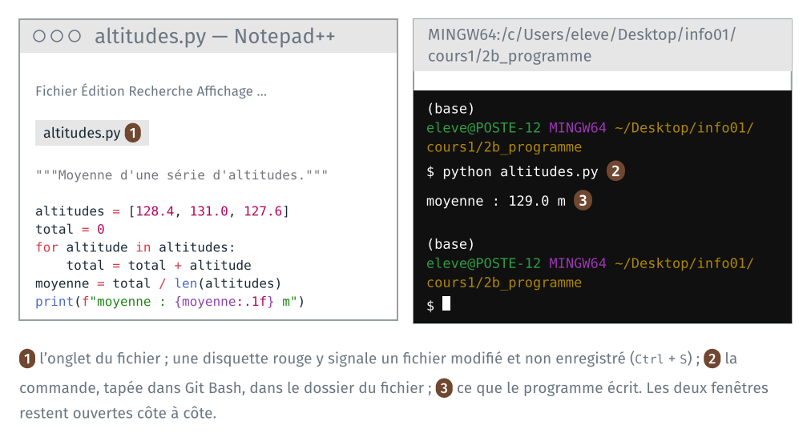

*Version 2 du cours 1 : proposition de travail pour 2027-2028. Ce guide
reprend le programme et la session interactive du TD 2a de 2026, sans VS
Code : le programme s'ouvre dans Notepad++ et se lance dans Git Bash.*

Un programme Python est un fichier texte. Le TD commence par un réglage fait
une fois par poste, qui rend Python disponible dans Git Bash. Il ouvre
ensuite le programme dans un éditeur de texte, Notepad++, et le fait
exécuter par l'interpréteur Python depuis le terminal du TD 2a, Git Bash. Il le modifie, le relance, puis refait son
calcul ligne à ligne dans une session interactive. Il dure une dizaine de
minutes.

| Étape | Ce qu'on fait |
|---|---|
| 1 | rendre Python disponible dans Git Bash, une fois par poste |
| 2 | ouvrir `altitudes.py` dans Notepad++ |
| 3 | le lancer dans Git Bash |
| 4 | le modifier, et le relancer avant et après l'enregistrement |
| 5 | refaire le calcul dans une session interactive de Python |

Sur un poste où l'étape 1 est déjà faite, l'invite de Git Bash commence
par `(base)`, et `python --version` affiche une version : passer à
l'étape 2.



## 1 · Python dans Git Bash, une fois par poste

> **À faire :** constater que `python` est introuvable ; configurer conda dans Git Bash ; fermer et rouvrir Git Bash.
>
> **À obtenir :** l'invite commence par `(base)` ; `python --version` affiche la version d'Anaconda.

*Étape à vérifier sur un poste de la salle avant la version finale du
guide.*

### Avant

Dans Git Bash, ouvert au TD 2a dans `2a_terminal/` :

```text
cd ../2b_programme
python --version
```

Git Bash affiche `bash: python: command not found`, ou un message qui
renvoie au Microsoft Store. Anaconda est installé sur le poste, dans
`C:\ProgramData\anaconda3`, mais Git Bash ne le connaît pas encore.

### Configurer conda dans Git Bash

```text
source /c/ProgramData/anaconda3/etc/profile.d/conda.sh
conda init bash
```

`source` rend la commande `conda` disponible dans ce terminal. `conda init
bash` écrit l'instruction équivalente dans le fichier `~/.bash_profile`, que
Git Bash lit à chaque ouverture. Il affiche une ligne par fichier examiné,
`no change` ou `modified`, puis :

```text
==> For changes to take effect, close and re-open your current shell. <==
```

Fermer Git Bash (`exit`, ou la croix de la fenêtre), et le rouvrir dans
`2b_programme`, par le clic droit du TD 2a.

**Vérification** : la première ligne de l'invite est `(base)`. Puis :

```text
python --version
ls -a ~
```

`python --version` affiche `Python 3.` suivi de la version installée par
Anaconda. `ls -a ~` liste le dossier personnel, et parmi les noms,
`.bash_profile` : un fichier caché, écrit par `conda init bash`.

Le réglage reste d'une séance à l'autre : les postes de la salle gardent le
dossier personnel. Il se refait sur un autre poste.

### Si ça bloque

- **`source` affiche `No such file or directory`.** Anaconda est installé
  dans un autre dossier sur ce poste. Essayer
  `source /c/Users/$USERNAME/anaconda3/etc/profile.d/conda.sh`, ou prévenir
  l'enseignant.
- **`conda init bash` écrit `needs sudo`, ou une fenêtre de Windows
  demande des droits d'administrateur.** Fermer la fenêtre par « Non ». Écrire la ligne à la main, dans
  le seul fichier du dossier personnel, puis fermer et rouvrir Git Bash :

  ```text
  echo 'eval "$(/c/ProgramData/anaconda3/Scripts/conda.exe shell.bash hook)"' >> ~/.bash_profile
  ```

- **Chaque nouveau Git Bash affiche l'aide de `cygpath`** (`Usage: cygpath
  …`), puis `bash: : No such file or directory`. L'environnement `base` est
  activé quand même : le message vient d'un `cygpath` fourni par Anaconda,
  qui échoue sous Git Bash. Pour le faire disparaître, taper une fois, puis
  rouvrir Git Bash :

  ```text
  sed -i '1i cygpath() { /usr/bin/cygpath "$@"; }' ~/.bash_profile
  ```

## 2 · Ouvrir le programme dans Notepad++

> **À faire :** ouvrir `cours1\2b_programme\altitudes.py` dans Notepad++.
>
> **À obtenir :** le programme affiché, en couleur.

1. Lancer Notepad++ (menu Démarrer, « Notepad++ »).
2. Menu Fichier, Ouvrir…, aller dans `Bureau\info01\cours1\2b_programme`,
   et choisir `altitudes.py`.

Le fichier compte huit lignes : une chaîne de documentation, une ligne
vide, puis six lignes de code.

```python
"""Moyenne d'une série d'altitudes, à la main plutôt qu'avec sum()."""

altitudes = [128.4, 131.0, 127.6]
total = 0
for altitude in altitudes:
    total = total + altitude
moyenne = total / len(altitudes)
print(f"moyenne : {moyenne:.1f} m")
```

**À noter** : les couleurs, et le nom du langage affiché en bas à gauche
de la fenêtre de Notepad++.

## 3 · Lancer le programme dans Git Bash

> **À faire :** placer Git Bash dans `2b_programme/` ; `python altitudes.py`.
>
> **À obtenir :** `moyenne : 129.0 m`.

Dans Git Bash, rouvert dans `2b_programme/` à l'étape 1 :

```text
ls
python altitudes.py
```

`ls` affiche `altitudes.py`. La commande `python altitudes.py` lance
l'interpréteur Python, qui lit le fichier et l'exécute :

```text
moyenne : 129.0 m
```

Le programme n'écrit qu'une ligne, celle du `print` final. La moyenne de
128,4, 131,0 et 127,6 vaut bien 129,0.

**Vérification** : `ls` après l'exécution affiche toujours le seul
`altitudes.py`. Lancer un programme Python ne crée aucun fichier.

Si Git Bash affiche `python: command not found`, l'étape 1 n'est pas faite
sur ce poste. Si Python affiche `can't open file … No such
file or directory`, le dossier courant n'est pas `2b_programme` : lire
l'invite, et refaire le `cd`.

## 4 · Modifier, relancer

> **À faire :** ajouter une altitude à la liste, relancer sans enregistrer, puis enregistrer et relancer.
>
> **À obtenir :** `moyenne : 130.1 m` après l'enregistrement.

1. Dans Notepad++, ajouter `133.2` à la liste :

   ```python
   altitudes = [128.4, 131.0, 127.6, 133.2]
   ```

   Ne pas enregistrer. L'onglet du fichier porte une disquette rouge : le
   fichier affiché diffère du fichier enregistré.

2. Dans Git Bash, relancer : flèche vers le haut, qui rappelle la commande
   précédente, puis `Entrée`.

   **À noter** : la moyenne affichée.

3. Dans Notepad++, enregistrer : `Ctrl` + `S`. La disquette redevient
   bleue.

4. Relancer dans Git Bash.

**Vérification** :

```text
moyenne : 130.1 m
```

La moyenne des quatre altitudes vaut 130,05, arrondie à une décimale par
`:.1f`.

## 5 · Python en interactif

> **À faire :** ouvrir une session interactive de Python ; y refaire le calcul ligne à ligne ; la quitter.
>
> **À obtenir :** `129.0` affiché par la session, puis le retour à l'invite de Git Bash.

Dans Git Bash, taper `python` sans nom de fichier : l'interpréteur ouvre une
session interactive. Chaque ligne tapée est lue, exécutée, et son résultat
affiché aussitôt.

```text
$ python
Python 3.12.14 (main, Sep  2 2026, 23:27:36) [GCC 15.3.0] on linux
>>> altitudes = [128.4, 131.0, 127.6]
>>> total = 0
>>> for altitude in altitudes:
...     total = total + altitude
...
>>> total
387.0
>>> total / len(altitudes)
129.0
>>> exit()
```

Session relevée sous Linux ; la première ligne, qui donne la version de
Python, diffère sur les postes de la salle.

Les trois chevrons `>>>` sont l'invite de Python : la session attend une
ligne de Python. Les commandes de Git Bash ne s'y tapent pas. Les trois points `...`
marquent la suite d'un bloc commencé, ici la boucle : taper quatre espaces
avant `total = total + altitude`, puis `Entrée` sur une ligne vide pour
finir le bloc. `total` s'affiche sans `print` : la session affiche la
valeur de chaque expression tapée.

`exit()` quitte la session ; l'invite de Git Bash revient.

**Vérification** : après `exit()`, la ligne attend une commande après `$`.

Si une commande de Git Bash, comme `ls`, est tapée dans la session Python,
Python affiche `NameError: name 'ls' is not defined`. Lire l'invite avant
de taper : `$` pour Git Bash, `>>>` pour Python.

## Ce que le TD fait constater

À lire après avoir fait les étapes.

**Un réglage écrit dans un fichier caché.** `conda init bash` a écrit dans
`~/.bash_profile`, que Git Bash lit à chaque ouverture : d'où le `(base)`,
et le `python` d'Anaconda. Le cours 2 ouvre le même Git Bash dans l'éditeur
de code, qui lit le même fichier.

**Un programme est un fichier texte.** Notepad++ affiche `altitudes.py`
comme les fichiers `.css` et `.html` du TD 1a : il reconnaît l'extension
`.py`, et colore le code Python. Les couleurs ne sont pas dans le
fichier. N'importe quel éditeur de texte sert à écrire un programme ; le
cours 2 installe un éditeur de code, qui ajoute d'autres services.

**L'interpréteur lit le fichier enregistré.** À l'étape 4, la moyenne ne
change pas tant que le fichier n'est pas enregistré : `python` lit le
fichier sur le disque. Le texte affiché par Notepad++ n'y est qu'une fois
enregistré.

**Un programme, une session.** Le programme lancé en entier n'affiche que
ce que ses `print` écrivent, et se relance à l'identique. La session
interactive affiche la valeur de chaque ligne, et ne garde rien sur le
disque. Un notebook, à la partie 3, réunit les deux : du code enregistré
dans un fichier, exécuté morceau par morceau, avec les résultats affichés.
