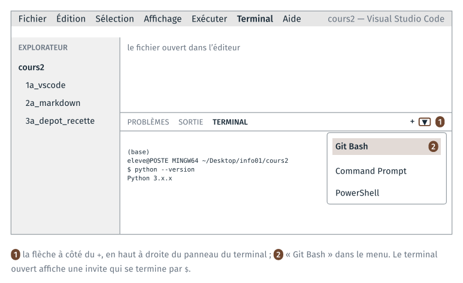

*Version 2 du cours 2 : proposition de travail pour 2027-2028. Ce guide
reprend des parties du guide du TD 2a du cours 1 de 2026 ; VS Code y est
lancé depuis le menu Démarrer, et son terminal est Git Bash.*

Le TD configure l'éditeur de code du module, VS Code, pour le reste de
l'année. Il se fait en classe entière : l'enseignant projette chaque étape,
chacun la fait sur son poste, et la salle passe à l'étape suivante quand
tout le monde a fini. Il dure vingt-cinq minutes. Le guide peut se lire
avant la séance, et le TD se commencer seul.

La configuration se fait une fois par poste. Elle reste pour les séances
suivantes : les postes de la salle gardent les réglages d'une séance à
l'autre.

| Étape | Ce qu'on fait |
|---|---|
| 1 | copier et décompresser les fichiers de la séance, dans Git Bash |
| 2 | lancer VS Code et ouvrir le dossier `cours2` |
| 3 | installer l'extension Python |
| 4 | faire de Git Bash le terminal de VS Code |
| 5 | choisir l'interpréteur Python, et lancer un programme |
| 6 | deux réglages, puis leur fichier `settings.json` |

Chaque étape se termine par une vérification. Une étape dont la
vérification échoue se reprend avant de passer à la suivante ; la fin de
chaque étape donne la marche à suivre dans les cas rencontrés en 2026.

## 1 · Copier et décompresser les fichiers de la séance

> **À faire :** copier l'archive de la séance dans `Desktop\info01` ; la décompresser dans Git Bash.
>
> **À obtenir :** `ls cours2` affiche les trois dossiers des TD.

### Copier l'archive

Comme au cours 1 : sur le Bureau, ouvrir le raccourci `formationTemp`,
copier `info01-cours2.zip`, et le coller dans le dossier `info01` du
Bureau, à côté de `cours1`. Ne pas travailler dans `formationTemp`, dossier
du serveur commun à toute la promotion.

### Décompresser dans Git Bash

Ouvrir Git Bash (menu Démarrer, « Git Bash »), puis :

```text
cd ~/Desktop/info01
ls
```

`ls` affiche `cours1/` et `info01-cours2.zip`. Puis :

```text
unzip info01-cours2.zip
```

`unzip` affiche une ligne par fichier extrait (`creating:` pour un dossier,
`inflating:` pour un fichier).

**Vérification** :

```text
ls cours2
```

```text
1a_vscode/  2a_markdown/  3a_depot_recette/
```

Si `unzip` affiche `command not found`, décompresser à la souris : clic
droit sur l'archive, « Extraire tout… », en effaçant la fin du dossier
proposé pour garder `Desktop\info01`.

Si l'invite de Git Bash ne commence pas par `(base)`, la configuration de
conda dans Git Bash, faite au TD 2b du cours 1, manque sur ce poste. La
faire maintenant, avant l'étape 4 :

```text
source /c/ProgramData/anaconda3/etc/profile.d/conda.sh
conda init bash
```

puis fermer Git Bash et le rouvrir.

## 2 · Lancer VS Code et ouvrir le dossier de la séance

> **À faire :** lancer VS Code depuis le menu Démarrer ; ouvrir le dossier `Desktop\info01\cours2`.
>
> **À obtenir :** l'explorateur de VS Code affiche les trois dossiers des TD.

1. Menu Démarrer, taper « Visual Studio Code », Entrée. La page d'accueil
   de VS Code s'ouvre.
2. Menu File, Open Folder… Dans la fenêtre, aller dans le Bureau, puis
   `info01`, cliquer une fois sur `cours2`, et « Sélectionner un dossier ».
3. Une fenêtre demande si l'on fait confiance aux auteurs des fichiers du
   dossier : répondre « Yes, I trust the authors ». Sans cette réponse,
   VS Code ouvre le dossier en mode restreint, et les extensions n'y
   fonctionnent pas.

La fenêtre a trois zones : l'explorateur à gauche (`Ctrl` + `Maj` + `E`),
le fichier ouvert au centre, le terminal en bas (menu Terminal, New
Terminal). Le dossier ouvert est le projet : l'explorateur montre ses
fichiers, la recherche s'y fait, et le terminal s'y ouvre.

VS Code s'affiche en anglais. Le guide donne les intitulés anglais.

**Vérification** : l'explorateur affiche `1A_VSCODE`, `2A_MARKDOWN` et
`3A_DEPOT_RECETTE` sous le titre `COURS2`.

## 3 · Installer l'extension Python

> **À faire :** ouvrir un programme Python ; installer l'extension `ms-python.python`.
>
> **À obtenir :** l'extension « Python » de Microsoft dans la liste des extensions installées.

### Un programme avant l'installation

Dans l'explorateur, ouvrir `1a_vscode`, puis cliquer sur `altitudes.py`.
Le programme du cours 1 s'ouvre au centre.

**À noter** : si le texte est coloré, alors qu'aucune extension Python
n'est encore installée.

### Installer l'extension

1. Ouvrir le panneau Extensions : `Ctrl` + `Maj` + `X`, ou l'icône des
   quatre carrés dans la barre de gauche.
2. Dans la zone de recherche en haut du panneau, taper l'identifiant de
   l'extension, `ms-python.python`.
3. L'extension « Python », publiée par Microsoft (le nom de l'éditeur est
   écrit sous celui de l'extension, avec une coche bleue), vient en tête de
   la liste. Cliquer dessus : sa page s'ouvre à droite.
4. Vérifier son identifiant : à droite de la page, en bas de la colonne
   « Marketplace Info », la ligne « Identifier » doit indiquer
   `ms-python.python`.
5. Cliquer sur Install, et attendre la fin de l'installation.

Plusieurs extensions s'appellent « Python », et certaines ne viennent pas de
Microsoft. Seul l'identifiant désigne sans ambiguïté la bonne, d'où la
recherche par identifiant plutôt que par nom.

L'installation télécharge l'extension depuis un serveur. Sans réseau, le
panneau reste vide ou l'installation ne finit pas : vérifier que la session
réseau est ouverte, puis recommencer. Une extension installée le reste pour
les séances suivantes.

**Vérification** : l'extension « Python » est dans la section
« Installed » du panneau, avec « Pylance » et « Python Debugger »,
installées avec elle.

## 4 · Git Bash, terminal de VS Code

> **À faire :** choisir Git Bash comme terminal par défaut ; ouvrir un nouveau terminal.
>
> **À obtenir :** un terminal Git Bash, dont l'invite commence par `(base)`.

### Choisir le terminal par défaut

1. Palette de commandes : `Ctrl` + `Maj` + `P`. Une zone de saisie s'ouvre
   en haut de la fenêtre.
2. Taper `default profile`, puis choisir « Terminal: Select Default
   Profile ».
3. Dans la liste (Command Prompt, Git Bash, PowerShell…), choisir « Git
   Bash ».

La palette de commandes donne accès à toutes les commandes de VS Code par
leur nom, sans passer par les menus. Le module s'en sert souvent.

### Ouvrir un terminal

Menu Terminal, New Terminal. Le terminal s'ouvre en bas, dans le dossier
`cours2`.



**Vérification** : l'invite du terminal est

```text
(base)
eleve@POSTE MINGW64 ~/Desktop/info01/cours2
$
```

(le nom du poste change d'une machine à l'autre). Puis :

```text
python --version
```

affiche `Python 3.` suivi de la version installée par Anaconda.

### Si ça bloque

- **« Git Bash » n'est pas dans la liste.** Fermer VS Code et le relancer ;
  VS Code cherche les terminaux au démarrage. S'il reste absent, git n'est
  pas installé à l'emplacement habituel (`C:\Program Files\Git`) :
  prévenir l'enseignant.
- **Le terminal ouvert est PowerShell** (l'invite commence par `PS`). Le
  terminal a été ouvert avant le réglage : le fermer (icône de corbeille, en
  haut à droite du panneau), puis en ouvrir un nouveau. La flèche à côté du
  `+`, en haut à droite du panneau, ouvre aussi un terminal Git Bash.
- **Le message `activate.ps1 cannot be loaded because running scripts is
  disabled on this system`.** Même cause : le terminal est PowerShell.
- **Pas de `(base)` dans l'invite, et `python` introuvable.** conda n'est
  pas configuré dans Git Bash sur ce poste : voir la fin de l'étape 1.

## 5 · Choisir l'interpréteur Python, et lancer un programme

> **À faire :** choisir l'interpréteur `base` d'Anaconda ; lancer `altitudes.py` par le bouton d'exécution.
>
> **À obtenir :** `moyenne : 129.0 m` dans le terminal.

### Choisir l'interpréteur

1. Garder `altitudes.py` ouvert au centre.
2. Palette (`Ctrl` + `Maj` + `P`), taper « Python: Select Interpreter »,
   puis Entrée.
3. Une liste apparaît, avec pour chaque Python trouvé sur le poste son nom,
   son chemin et son type. Choisir la ligne `base`, de type Conda, dont le
   chemin contient `anaconda3` : sur les postes de la salle,
   `C:\ProgramData\anaconda3\python.exe`. Lire le chemin, et pas seulement
   le nom.

Le nom de l'interpréteur choisi s'affiche en bas à droite de la fenêtre, et
VS Code le retient pour ce dossier.

Si la liste ne contient ni `base` ni aucun chemin avec `anaconda3`, choisir
« Enter interpreter path… », puis « Find… », et désigner le fichier
`C:\ProgramData\anaconda3\python.exe`.

### Lancer le programme

En haut à droite de la zone du code, cliquer sur le triangle « Run Python
File ».

**Vérification** : le terminal affiche la commande que le bouton a tapée,
puis le résultat :

```text
moyenne : 129.0 m
```

La commande tapée par le bouton est `python`, précédé du chemin complet de
l'interpréteur choisi, suivi du chemin du fichier : la même commande que
celle tapée à la main au cours 1, avec des chemins absolus.

## 6 · Deux réglages, puis leur fichier

> **À faire :** régler, au niveau User, l'affichage des espaces et l'enregistrement automatique ; ouvrir le fichier `settings.json`.
>
> **À obtenir :** `settings.json` contient les deux réglages et celui du terminal.

### Deux niveaux de réglages

Les réglages de VS Code s'ouvrent par `Ctrl` + `,`. En haut de la page,
deux onglets :

| Onglet | S'applique à | Fichier |
|---|---|---|
| User | tous les dossiers ouverts avec ce compte, sur ce poste | `settings.json` du compte, dans `C:\Users\eleve\AppData\Roaming\Code\User\` |
| Workspace | le dossier ouvert seulement | `.vscode/settings.json`, dans le dossier ouvert |

Un réglage du dossier (Workspace) l'emporte sur celui du compte (User).
Le premier voyage avec le projet, et se versionne avec lui ; le second
reste sur le poste.

### Les deux réglages

Dans l'onglet User :

1. Taper `render whitespace` dans la zone de recherche. Le réglage « Editor:
   Render Whitespace » s'affiche ; choisir `all` dans sa liste.
2. Taper `auto save`. Pour « Files: Auto Save », choisir `afterDelay`.

**Vérification** : dans `altitudes.py`, un point gris marque chaque espace
d'indentation, comme dans Notepad++ au cours 1 ; en modifiant le fichier, le
point blanc de l'onglet (fichier non enregistré) disparaît après une
seconde.

### Le fichier des réglages

Palette (`Ctrl` + `Maj` + `P`), « Preferences: Open User Settings (JSON) ».
Le fichier du compte s'ouvre au centre. Il contient au moins :

```json
{
    "terminal.integrated.defaultProfile.windows": "Git Bash",
    "editor.renderWhitespace": "all",
    "files.autoSave": "afterDelay"
}
```

L'ordre des lignes peut différer, et d'autres lignes peuvent y être,
écrites par les extensions. Ne rien modifier, et fermer le fichier.

Chaque réglage a un nom en plusieurs parties séparées par des points,
`editor.renderWhitespace`, et une valeur. L'onglet des réglages et ce
fichier montrent les mêmes réglages : l'onglet écrit dans le fichier.

## Ce que le TD fait constater

À lire après avoir fait les étapes.

**L'éditeur, le langage, l'interpréteur.** Le texte de `altitudes.py` est
coloré avant toute installation : la coloration des langages courants est
livrée avec VS Code. L'extension Python apporte le reste : le choix de
l'interpréteur, l'exécution, la vérification du code pendant la frappe.
L'interpréteur n'est pas dans VS Code : l'éditeur appelle celui
d'Anaconda, installé à part.

**Le terminal de VS Code est Git Bash.** Le terminal du cours 1 s'ouvre
dans la fenêtre de l'éditeur. Il lit au démarrage le fichier `~/.bash_profile`
écrit par `conda init bash`, d'où le `(base)` et le `python` d'Anaconda.
En 2026, VS Code ouvrait un terminal PowerShell, qui n'exécutait pas le
script d'activation de conda sur les postes de la salle.

**Le bouton d'exécution tape une commande.** Le bouton écrit dans le
terminal la commande `python … altitudes.py`, avec l'interpréteur choisi à
l'étape 5. Si cet interpréteur et le `python` du terminal diffèrent, un
programme peut marcher par le bouton et échouer au terminal : le cours 3 y
revient, avec les environnements.

**Les réglages sont du texte.** L'onglet des réglages écrit dans
`settings.json`. Un réglage de dossier, dans `.vscode/settings.json`,
accompagne le projet quand il est copié ou versionné.
