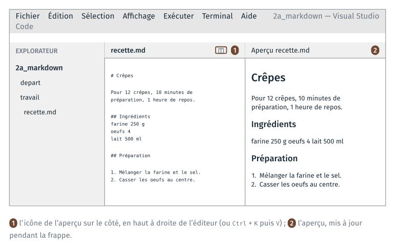

*Version 2 du cours 2 : proposition de travail pour 2027-2028. Ce guide
reprend celui du TD 3a du cours 1 de 2026, sans le diagramme Mermaid, et
ajoute la conversion par pandoc.*

Le TD part d'un texte brut, une recette de crêpes écrite sans aucune
structure : ni titre, ni liste, ni tableau. On le réécrit en Markdown dans
l'éditeur de code, VS Code, avec l'aperçu ouvert à côté, en décidant ce qui
est un titre, ce qui est une étape et ce qui est une donnée. On y ajoute un
tableau et une photo, puis on convertit le fichier en page web et en
document LibreOffice avec pandoc. Le TD dure une quinzaine de minutes.

Tout se fait dans VS Code, configuré au TD 1a. L'aperçu Markdown est livré
avec l'éditeur, et pandoc avec Anaconda : il n'y a rien à installer.

Le fichier écrit, `travail/recette.md`, est celui du premier commit du
TD 3a, dans un dépôt git.

| Étape | Ce qu'on fait |
|---|---|
| 1 | ouvrir le dossier, créer `recette.md` et ouvrir l'aperçu |
| 2 | poser les titres et la liste des étapes |
| 3 | écrire le tableau des ingrédients |
| 4 | afficher la photo |
| 5 | convertir le fichier avec pandoc, et comparer au résultat attendu |

Ce que chaque étape fait constater est expliqué à la fin du guide, dans « Ce
que le TD fait constater » : faire l'étape d'abord, et noter ce qu'on
observe, avant de lire l'explication.

## 1 · Ouvrir le dossier, créer `recette.md` et ouvrir l'aperçu

> **À faire :** ouvrir `cours2\2a_markdown\` dans VS Code ; enregistrer
> `depart\recette_a_formater.txt` sous `travail\recette.md` ; ouvrir
> l'aperçu à côté.
>
> **À obtenir :** `recette.md` ouvert à gauche, son aperçu à droite.

### Le dossier du TD

Le dossier `info01\cours2\2a_markdown\` contient :

```text
2a_markdown\
├── depart\
│   ├── recette_a_formater.txt   le texte de départ, sans aucune structure
│   ├── ingredients.csv          les ingrédients, à transformer en tableau
│   ├── crepes.jpg               la photo de la recette
│   └── recette.md               le résultat attendu, à n'ouvrir qu'à la fin
├── travail\                     vide
└── td_2a_markdown.pdf           la feuille du TD
```

Comme aux TD précédents, `depart\` contient les fichiers fournis et ne se
modifie pas ; les fichiers écrits pendant le TD sont enregistrés dans
`travail\`.

### Ouvrir le dossier dans VS Code

Le dossier `cours2` est ouvert dans VS Code depuis le TD 1a. Ouvrir
`2a_markdown` dans le panneau Explorer. Pour n'ouvrir que ce dossier : menu
File, Open Folder (Fichier, Ouvrir le dossier), et choisir
`Bureau\info01\cours2\2a_markdown`. Le panneau Explorer, à gauche, montre
`depart` et `travail`. Si VS Code demande si l'on fait confiance aux auteurs
du dossier, répondre « Yes, I trust the authors ».

### Enregistrer le texte sous un autre nom

1. Dans le panneau Explorer, ouvrir `depart`, puis cliquer sur
   `recette_a_formater.txt`. Le texte s'ouvre : vingt lignes, sans marque
   de mise en forme.
2. Menu File, Save As… (`Ctrl` + `Maj` + `S`). Dans la fenêtre, remonter
   d'un dossier, ouvrir `travail`, et taper le nom `recette.md`, avec son
   extension. Enregistrer.

L'onglet porte maintenant le nom `recette.md`, et le fichier apparaît sous
`travail` dans le panneau Explorer. `depart\recette_a_formater.txt` n'a pas
changé.

**Vérification** : en bas à droite de la fenêtre, la barre d'état indique le
langage du fichier, « Markdown ». Si elle indique « Plain Text », le fichier
a gardé l'extension `.txt` : recommencer l'enregistrement en tapant bien
`.md` à la fin du nom.

Le texte de départ est écrit sans accents. Le TD ne demande pas de les
rétablir ; le résultat attendu, `depart\recette.md`, les contient.

### Ouvrir l'aperçu

Cliquer dans `recette.md`, puis taper `Ctrl` + `K`, relâcher, et taper `V`.
L'aperçu s'ouvre à droite, et l'éditeur reste à gauche.

| L'action | Ce qu'elle ouvre | Quand s'en servir |
|---|---|---|
| `Ctrl` + `K` puis `V` | l'aperçu à droite, l'éditeur reste à gauche | pendant qu'on écrit : l'aperçu se met à jour pendant la frappe |
| `Ctrl` + `Maj` + `V` | l'aperçu seul, dans un onglet | pour relire, une fois le texte écrit |

Les deux commandes existent aussi dans la palette (`Ctrl` + `Maj` + `P`),
sous les noms « Markdown: Open Preview to the Side » et « Markdown: Open
Preview ». Elles ne fonctionnent que dans un fichier dont le langage est
Markdown : dans le `.txt` de départ, le raccourci ne fait rien.



**À noter** : comment l'aperçu affiche les lignes des ingrédients, avant
toute mise en forme.

## 2 · Poser les titres et la liste des étapes

> **À faire :** un titre en `#`, deux sous-titres en `##` ; les étapes de
> préparation en liste numérotée.
>
> **À obtenir :** dans l'aperçu, un grand titre, deux sous-titres et six
> étapes numérotées.

### Les titres

Le texte a un titre, la ligne `Crepes`, et deux parties, `Ingredients` et
`Preparation`. Un titre s'écrit en commençant la ligne par `#`, suivi d'un
espace ; un sous-titre par `##` :

```markdown
# Crêpes

Pour 12 crêpes, 10 minutes de préparation, 1 heure de repos.

## Ingrédients
```

L'espace après le dièse est obligatoire : `#Crepes` reste un paragraphe
ordinaire. Regarder l'aperçu après chaque ligne modifiée.

### La liste des étapes

Les six lignes qui suivent `Preparation` sont les étapes. Une liste numérotée
s'écrit en commençant chaque ligne par un nombre, un point et un espace :

```markdown
## Préparation

1. Mélanger la farine et le sel dans un saladier.
2. Casser les œufs au centre et mélanger.
```

Laisser une ligne vide entre le sous-titre et la liste, comme entre deux
paragraphes. Une ligne qui suit une autre sans ligne vide est rattachée au
même paragraphe.

**À noter** : ce que devient l'aperçu si l'on numérote toutes les étapes
`1.`, au lieu de `1.`, `2.`, `3.`…

## 3 · Écrire le tableau des ingrédients

> **À faire :** remplacer les cinq lignes d'ingrédients par un tableau à
> deux colonnes, à partir de `depart\ingredients.csv`.
>
> **À obtenir :** dans l'aperçu, un tableau « Ingrédient », « Quantité » de
> cinq lignes.

### Le fichier CSV

Ouvrir `depart\ingredients.csv` dans VS Code (clic dans le panneau
Explorer). Il contient six lignes, un en-tête puis un ingrédient par ligne,
les deux colonnes séparées par une virgule :

```text
Ingrédient,Quantité
Farine,250 g
Œufs,4
Lait,500 ml
Sel,1 pincée
Beurre fondu,50 g
```

### Le tableau Markdown

Un tableau Markdown est fait de lignes dont les cellules sont séparées par
des barres verticales, `|` (`AltGr` + `6` sur un clavier français). La
deuxième ligne, faite de tirets, sépare l'en-tête du reste :

```markdown
| Ingrédient | Quantité |
|---|---|
| Farine | 250 g |
| Œufs | 4 |
```

1. Copier les six lignes du CSV (`Ctrl` + `A`, `Ctrl` + `C`), et les coller
   dans `recette.md` à la place des lignes d'ingrédients.
2. Sur chaque ligne, remplacer la virgule par ` | `, et ajouter une barre au
   début et à la fin.
3. Insérer la ligne `|---|---|` sous l'en-tête.
4. Laisser une ligne vide avant et après le tableau.

La première fois, le tableau se tape à la main. Des extensions du catalogue
produisent ensuite un tableau Markdown à partir d'un CSV en une commande
(chercher « CSV to Markdown Table » dans le panneau Extensions) ; plusieurs
existent, de qualité comparable, et aucune n'est nécessaire au TD.

**À noter** : ce que devient l'aperçu si les barres d'une colonne ne sont
pas alignées les unes sous les autres dans le fichier.

## 4 · Afficher la photo

> **À faire :** afficher `crepes.jpg` sous la ligne de présentation, par
> ``.
>
> **À obtenir :** la photo d'une crêpe dans l'aperçu.

Une image s'écrit comme un lien précédé d'un point d'exclamation : entre
crochets, une légende qui décrit l'image ; entre parenthèses, le chemin du
fichier.

1. Sous la ligne « Pour 12 crêpes… », ajouter une ligne vide puis :

   ```markdown
   
   ```

2. Regarder l'aperçu.

**À noter** : ce que l'aperçu affiche à la place de la photo, et où se
trouve `crepes.jpg` par rapport à `recette.md`.

Le chemin entre parenthèses est relatif : il part du dossier du fichier
`.md`. La photo peut apparaître de deux façons, au choix :

- copier `depart\crepes.jpg` dans `travail\`, à côté de `recette.md` ; le
  chemin `crepes.jpg` est alors correct ;
- ou laisser la photo où elle est, et écrire le chemin qui y mène depuis
  `travail\` : `../depart/crepes.jpg`.

**Vérification** : la photo s'affiche dans l'aperçu, sous la ligne de
présentation.

## 5 · Convertir le fichier avec pandoc

> **À faire :** dans le terminal de VS Code, se placer dans `travail/` ;
> convertir `recette.md` en `recette.html`, puis en `recette.odt` ; ouvrir
> les deux fichiers.
>
> **À obtenir :** la recette dans le navigateur, photo comprise, et dans
> LibreOffice Writer.

### Se placer dans `travail/`

Ouvrir un terminal (menu Terminal, New Terminal). Depuis le TD 1a, VS Code
ouvre Git Bash, dans le dossier ouvert. Se placer dans
`travail/` :

```text
cd ~/Desktop/info01/cours2/2a_markdown/travail
ls
```

**Vérification** : `ls` affiche `recette.md`, et `crepes.jpg` si la photo a
été copiée à l'étape 4.

### Une page web

```text
pandoc recette.md -o recette.html
start recette.html
```

pandoc n'affiche rien quand tout se passe bien. `-o` (pour _output_) donne
le fichier à écrire ; pandoc déduit le format de son extension. `start`
ouvre la page dans le navigateur, comme un double-clic.

**Vérification** : la page affiche le titre, le tableau, la liste et la
photo. Si la photo manque, `crepes.jpg` n'est pas dans `travail/` :
l'y copier (`cp ../depart/crepes.jpg .`), refaire la commande `pandoc`, puis
`F5` dans le navigateur.

### Un document LibreOffice

```text
pandoc recette.md -o recette.odt
start recette.odt
```

**Vérification** : LibreOffice Writer ouvre la recette, avec des titres, un
tableau et une liste numérotée.

### La source et les fichiers produits

Dans `recette.md`, passer le lait de `500 ml` à `600 ml`, enregistrer, puis
refaire la page :

```text
pandoc recette.md -o recette.html
```

`F5` dans le navigateur : la page affiche `600 ml`. La page et le document
se refont depuis `recette.md` par la même commande ; `recette.md` est la
source.

**À noter** : ce que devient le `.odt` ouvert dans LibreOffice après la
modification, tant que la commande n'a pas été refaite.

### Comparer au résultat attendu

Ouvrir `depart\recette.md`, et son aperçu (`Ctrl` + `K` puis `V`). Comparer
les deux fichiers, le texte et l'aperçu. Le résultat attendu fait d'autres
choix que les vôtres sur quelques points : relever lesquels.

### Pour aller plus loin

- Une remarque, « la pâte se conserve 24 heures », en citation : une ligne
  qui commence par `>` suivi d'un espace.
- Une seconde photo, prise par vous (une crêpe, une poêle, la salle), copiée
  dans le dossier de votre choix et affichée par son chemin relatif depuis
  `travail\`.

## Ce que le TD fait constater

Cette section se lit après avoir fait les étapes.

### Étapes 1 et 2 : la structure se déclare

Avant toute mise en forme, l'aperçu affiche les cinq lignes d'ingrédients
bout à bout, en un seul paragraphe. Comme en HTML au TD 1a du cours 1, le saut de ligne
du fichier ne sépare pas deux paragraphes : il faut une ligne vide, ou une
marque qui déclare la nature de la ligne, `#` pour un titre, `1.` pour une
étape.

Le texte de départ ne dit pas ce qui est un titre et ce qui est une étape :
la personne qui le met en forme en décide, en lisant le contenu. La mise en
forme dépend donc de l'interprétation du texte, et deux interprétations
raisonnables peuvent différer, comme le montre la comparaison avec
`depart\recette.md`.

Dans une liste numérotée, l'aperçu renumérote les étapes à partir du premier
nombre : `1.` écrit six fois donne 1 à 6. Insérer une étape ne demande donc
pas de renuméroter le fichier.

Les deux aperçus ne modifient pas le `.md`. Ce qui est enregistré est le texte
tapé, lisible tel quel dans n'importe quel éditeur ; l'aperçu en est une
présentation, calculée à l'affichage.

### Étape 3 : un tableau fait de barres verticales

Un tableau Markdown s'écrit avec des barres verticales et une ligne de
tirets, sans autre marque. L'alignement des barres dans le fichier n'est pas
obligatoire : l'aperçu trace les colonnes, que les barres soient alignées ou
non. Les aligner rend
seulement le fichier plus lisible sans aperçu.

Le CSV et le tableau Markdown contiennent les mêmes données, écrites pour deux
lecteurs : le CSV pour un programme, qui sépare les colonnes à la virgule ; le
tableau pour un humain, qui lit le `.md` ou son aperçu.

### Étape 4 : une image désignée par son chemin

Le `.md` ne contient pas la photo : il contient son chemin, et l'aperçu lit
le fichier de la photo au moment de l'affichage. Le fichier `crepes.jpg`
reste un fichier distinct, et s'il est déplacé ou renommé, l'aperçu ne
l'affiche plus.

Le chemin `crepes.jpg` est relatif au dossier du fichier `.md`. Écrit dans
`travail\recette.md`, il désigne `travail\crepes.jpg`, qui n'existe pas tant
que la photo n'y a pas été copiée : l'aperçu montre alors une image absente,
avec au mieux sa légende. `..` désigne le dossier parent, et
`../depart/crepes.jpg` remonte de `travail\` à `3a_markdown\` avant de
descendre dans `depart\`. Markdown écrit les chemins avec des `/`, comme les
adresses du navigateur au TD 1a du cours 1. Dans `depart\recette.md`, le résultat
attendu, la photo est dans le même dossier que le fichier, et `crepes.jpg`
suffit.

La même règle s'appliquait à `href="style.css"` au TD 1a du cours 1 : la copie de la
page dans `travail\` perdait sa feuille de style pour la même raison.

La légende entre crochets est le texte affiché quand l'image manque, et celui
que lit un logiciel de lecture d'écran : elle décrit l'image.

### Étape 5 : une source, des fichiers produits

pandoc lit `recette.md` et écrit le même contenu dans un autre format. La
page web et le document LibreOffice ne sont pas modifiés à la main : ils se
refont depuis la source, par la même commande, chaque fois qu'elle change.
Tant que la commande n'est pas refaite, ils gardent l'ancienne version.

Le TD 3a en tire la règle de git : la source se versionne, les fichiers
produits se refont et ne se versionnent pas.

### Le résultat attendu

`depart\recette.md` compte vingt-quatre lignes. Il fait quelques choix que
la feuille ne demandait pas : la ligne de présentation en italique, entre
astérisques ; les mots « peu à peu » en gras, entre doubles astérisques. Il
rétablit aussi les accents. Aucun de ces choix n'est le seul possible.

Aucune des opérations du TD n'a nécessité de logiciel de mise en page, et le
fichier reste lisible sans aperçu. Il s'est converti en HTML et en `.odt`
par pandoc ; le PDF demande en plus un moteur de mise en page, absent des
postes de la salle.
