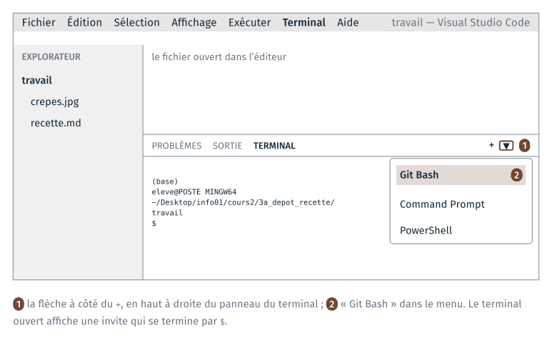
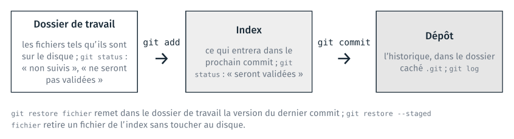
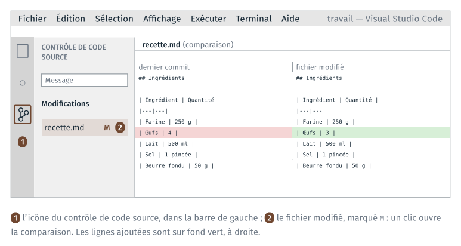
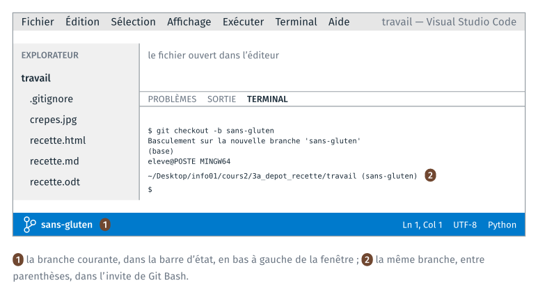
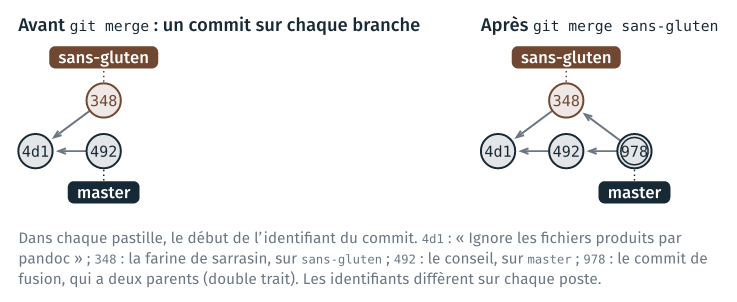
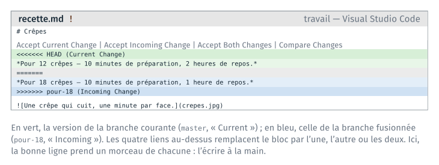

*Version 2 du cours 2 : proposition de travail pour 2027-2028. Les TD joués
en 2026 sont ceux de la séance 2, dans la partie « Séances V1 ».*

Ce guide détaille les étapes du TD 3a. Le TD versionne avec git la recette
écrite en Markdown au TD 2a : un premier commit, des modifications
comparées, un fichier produit par pandoc, puis une branche, une fusion et
un conflit. Il dure une quarantaine de minutes.

Pour chaque étape, le guide donne :

- les commandes à taper, dans l'ordre ;
- ce que git affiche en retour, relevé sur un poste où git parle français ;
- comment vérifier que la commande a fonctionné, et quoi faire sinon.

Les sorties de ce guide ont été relevées avec git 2.43 en français. Sur un
poste où git parle anglais, les messages sont les mêmes, en anglais : le
guide donne entre parenthèses les phrases anglaises à reconnaître. Les
identifiants de commit (`a16d497`…) sont différents sur chaque poste.

| Étape | Ce qu'on fait | Commits à la fin |
|---|---|---|
| 0 | copier la recette dans `travail/`, l'ouvrir dans VS Code | 0 |
| 1 | créer le dépôt, faire le premier commit | 1 |
| 2 | modifier la recette, lire la différence, faire un commit | 2 |
| 3 | abîmer une ligne, puis la restaurer | 2 |
| 4 | versionner un `.odt`, constater le problème, l'ignorer | 4 |
| 5 | une variante sans gluten sur une branche, fusionnée | 7 |
| 6 | la même ligne modifiée sur deux branches, et le conflit résolu | 10 |

Si le temps manque en séance, s'arrêter après l'étape 5 ; l'étape 6 se
fait ensuite avec ce guide.

## Rappels avant de commencer

**VS Code et son terminal.** Tout le TD se fait dans VS Code : l'explorateur
à gauche, le fichier ouvert au centre, le terminal Git Bash en bas. Le
terminal s'ouvre par le menu Terminal → New Terminal. Le TD 1a a fait de
Git Bash le terminal par défaut ; si le terminal ouvert est PowerShell,
choisir « Git Bash » dans la liste ouverte par la flèche à côté du `+`.



**L'invite de Git Bash.** Elle tient sur plusieurs lignes : `(base)`, puis
`eleve@POSTE MINGW64` suivi du dossier courant, puis `$`. Une fois le dépôt
créé, Git Bash ajoute à la fin du dossier courant le nom de la branche,
entre parenthèses : `~/…/travail (master)`.

**Enregistrer.** Le réglage `files.autoSave` du TD 1a enregistre les
fichiers tout seuls, après une seconde. Sans lui, `Ctrl` + `S` après chaque
modification : git lit le fichier enregistré sur le disque.

**La commande à taper en cas de doute.** `git status` affiche la
branche courante, les fichiers qui ont changé, et les commandes qui
s'appliquent. La taper avant de demander de l'aide.

**Les trois zones de git.** Le schéma ci-dessous sert à toutes les étapes.
`git add` place un fichier dans l'index ; `git commit` enregistre l'index
dans le dépôt.



**Un éditeur s'ouvre dans le terminal.** Si une commande git ouvre un
écran avec des `~` en début de ligne, l'éditeur vim est ouvert, pour
écrire un message. Taper `Échap`, puis `:wq` et `Entrée` pour garder le message
proposé, ou `:q!` et `Entrée` pour abandonner. Le guide donne chaque message
par `-m` pour éviter cet écran.

## Étape 0 · Préparer le dossier

> **À faire :** copier `recette.md` et `crepes.jpg` du TD 2a dans `3a_depot_recette/travail/` ; ouvrir `travail/` dans VS Code, avec un terminal Git Bash.
>
> **À obtenir :** l'explorateur de VS Code montre `crepes.jpg` et `recette.md` ; l'invite se termine par `3a_depot_recette/travail`.

**Dossier de départ** : `cours2/3a_depot_recette/`, tel que décompressé
depuis l'archive.

```text
3a_depot_recette/
├── depart/
│   ├── crepes.jpg
│   └── recette.md       (la recette attendue au TD 2a)
└── travail/             (vide)
```

### 0.1 Copier la recette

Dans le terminal de VS Code, se placer dans le dossier du TD, puis copier
la recette écrite au TD 2a et sa photo :

```text
cd ~/Desktop/info01/cours2/3a_depot_recette
cp ../2a_markdown/travail/recette.md ../2a_markdown/travail/crepes.jpg travail/
```

Si le TD 2a n'est pas terminé, copier la recette de `depart/` à la place :

```text
cp depart/recette.md depart/crepes.jpg travail/
```

**Vérification** : `ls travail` affiche `crepes.jpg` et `recette.md`.

### 0.2 Ouvrir `travail/` dans VS Code

File → Open Folder… → choisir `cours2\3a_depot_recette\travail`. VS Code se
rouvre sur ce dossier ; ouvrir un terminal (Terminal → New Terminal).

**Vérification** : l'explorateur montre les deux fichiers ; dans le
terminal, `pwd` affiche un chemin qui se termine par
`3a_depot_recette/travail`.

Le dépôt se crée dans le dossier courant du terminal. Si `pwd` affiche un
autre dossier, `cd` jusqu'à `travail/` avant l'étape 1.

## Étape 1 · Le dépôt et le premier commit

> **À faire :** `git init` ; régler son nom et son adresse pour ce dépôt ; `git add`, puis `git commit`.
>
> **À obtenir :** `git log --oneline` affiche une ligne, `Ajoute la recette des crêpes`.

### 1.1 Créer le dépôt

```text
git init
```

git affiche d'abord une dizaine de lignes qui commencent par `astuce:`
(`hint:` en anglais), sur le nom de la branche initiale : les ignorer. La
dernière ligne est :

```text
Dépôt Git vide initialisé dans …/3a_depot_recette/travail/.git/
```

(« Initialized empty Git repository in … ».) Puis :

```text
ls -a
```

```text
.
..
crepes.jpg
.git
recette.md
```

`.git` est le dépôt : un dossier caché, qui contiendra l'historique. Les
fichiers du dossier n'ont pas changé.

**Vérification** : l'invite se termine maintenant par `(master)`.

Si `git init` a été tapé dans un autre dossier (`3a_depot_recette/` par
exemple), supprimer le `.git` créé par erreur (`rm -rf .git`, dans ce
dossier-là), puis revenir dans `travail/` et recommencer.

### 1.2 Signer ses commits

Chaque commit porte le nom et l'adresse de son auteur. Les postes de la
salle sont partagés : le réglage se fait dans le dépôt, sans `--global`, et
ne vaut que pour lui.

```text
git config user.name "Prénom Nom"
git config user.email "prenom.nom@ensg.eu"
```

Remplacer par vos nom et adresse. Aucun message ne s'affiche.

**Vérification** : `git config user.name` affiche le nom.

### 1.3 Ce que git voit

```text
git status
```

```text
Sur la branche master

Aucun commit

Fichiers non suivis:
  (utilisez "git add <fichier>..." pour inclure dans ce qui sera validé)
	crepes.jpg
	recette.md

aucune modification ajoutée à la validation mais des fichiers non suivis sont présents (utilisez "git add" pour les suivre)
```

Les deux fichiers sont « non suivis » (« Untracked files ») : git les voit
dans le dossier, mais ne les a jamais enregistrés.

### 1.4 Le premier commit

```text
git add recette.md crepes.jpg
git status
```

```text
Sur la branche master

Aucun commit

Modifications qui seront validées :
  (utilisez "git rm --cached <fichier>..." pour désindexer)
	nouveau fichier : crepes.jpg
	nouveau fichier : recette.md
```

Les deux fichiers sont dans l'index (« Changes to be committed »). Le
commit enregistre l'index, avec un message qui décrit ce qu'il apporte :

```text
git commit -m "Ajoute la recette des crêpes"
```

```text
[master (commit racine) a16d497] Ajoute la recette des crêpes
 2 files changed, 24 insertions(+)
 create mode 100644 crepes.jpg
 create mode 100644 recette.md
```

`a16d497` est le début de l'identifiant du commit ; le vôtre est différent.

**Vérification** :

```text
git log --oneline
```

```text
a16d497 Ajoute la recette des crêpes
```

Si `git commit` affiche `Please tell me who you are`, l'étape 1.2 n'a pas
été faite dans ce dépôt : la faire, puis refaire le `git commit`.

## Étape 2 · Modifier, comparer, enregistrer

> **À faire :** passer les œufs de 4 à 3 dans `recette.md` ; lire `git status` et `git diff` ; faire un commit.
>
> **À obtenir :** `git log --oneline` affiche deux lignes.

### 2.1 Modifier la recette

Dans `recette.md`, ligne des œufs du tableau, remplacer `4` par `3`, et
enregistrer. La ligne devient :

```text
| Œufs | 3 |
```

### 2.2 Ce que git voit

```text
git status
```

```text
Sur la branche master
Modifications qui ne seront pas validées :
  (utilisez "git add <fichier>..." pour mettre à jour ce qui sera validé)
  (utilisez "git restore <fichier>..." pour annuler les modifications dans le répertoire de travail)
	modifié :         recette.md

aucune modification n'a été ajoutée à la validation (utilisez "git add" ou "git commit -a")
```

`recette.md` est modifié dans le dossier de travail, et pas encore dans
l'index (« Changes not staged for commit »). Les deux commandes proposées
entre parenthèses sont celles des étapes 2.4 et 3.

### 2.3 Lire la différence

```text
git diff
```

```text
diff --git a/recette.md b/recette.md
index aae4747..45bc5f0 100644
--- a/recette.md
+++ b/recette.md
@@ -9,7 +9,7 @@
 | Ingrédient | Quantité |
 |---|---|
 | Farine | 250 g |
-| Œufs | 4 |
+| Œufs | 3 |
 | Lait | 500 ml |
 | Sel | 1 pincée |
 | Beurre fondu | 50 g |
```

`a/` est la version du dernier commit, `b/` celle du disque. La ligne qui
commence par `-` est l'ancienne, celle qui commence par `+` la nouvelle ;
les autres lignes sont le contexte. `@@ -9,7 +9,7 @@` indique que le passage
commence à la ligne 9 et fait 7 lignes, avant comme après.

La même différence se lit dans VS Code : icône du contrôle de code source,
dans la barre de gauche (`Ctrl` + `Maj` + `G`), puis clic sur `recette.md`.



### 2.4 Le commit

```text
git add recette.md
git commit -m "Réduit les œufs à trois"
```

```text
[master fe4fe8b] Réduit les œufs à trois
 1 file changed, 1 insertion(+), 1 deletion(-)
```

Une ligne modifiée compte pour une ligne retirée et une ligne ajoutée.

**Vérification** :

```text
git log --oneline
```

```text
fe4fe8b Réduit les œufs à trois
a16d497 Ajoute la recette des crêpes
```

Le commit le plus récent est en haut. `git log`, sans option, donne aussi
l'identifiant complet, l'auteur et la date de chaque commit ; `q` quitte
l'affichage s'il ne tient pas dans le terminal.

## Étape 3 · Annuler une modification non enregistrée

> **À faire :** abîmer une ligne de la préparation ; la voir dans `git diff` ; `git restore`.
>
> **À obtenir :** `git status` affiche « rien à valider » ; la ligne est revenue.

### 3.1 Abîmer une ligne

Dans `recette.md`, remplacer la dernière étape de la préparation par
`6. Cuire.` et enregistrer. Puis :

```text
git diff
```

```text
diff --git a/recette.md b/recette.md
index 45bc5f0..ba43e4b 100644
--- a/recette.md
+++ b/recette.md
@@ -21,4 +21,4 @@
 3. Verser le lait **peu à peu**, sans cesser de remuer.
 4. Ajouter le beurre fondu.
 5. Laisser reposer une heure.
-6. Cuire dans une poêle chaude, une minute par face.
+6. Cuire.
```

### 3.2 Restaurer le fichier

```text
git restore recette.md
git status
```

```text
Sur la branche master
rien à valider, la copie de travail est propre
```

(« nothing to commit, working tree clean ».)

**Vérification** : dans VS Code, `recette.md` a retrouvé sa ligne
complète.

`git restore` remet le fichier dans l'état du dernier commit : la
modification est perdue, et aucune commande ne la retrouve. git ne peut
restaurer que ce qui a été enregistré par un commit.

## Étape 4 · Un fichier produit par pandoc

> **À faire :** produire `recette.html` et `recette.odt` ; faire un commit du `.odt` ; modifier la recette, refaire le `.odt`, lire `git diff` ; retirer le `.odt` du dépôt et ignorer les fichiers produits.
>
> **À obtenir :** `git status` affiche « rien à valider », alors que `recette.html` et `recette.odt` sont dans le dossier.

### 4.1 Produire la page et le document

Les deux commandes du TD 2a :

```text
pandoc recette.md -o recette.html
pandoc recette.md -o recette.odt
git status
```

```text
Sur la branche master
Fichiers non suivis:
  (utilisez "git add <fichier>..." pour inclure dans ce qui sera validé)
	recette.html
	recette.odt

aucune modification ajoutée à la validation mais des fichiers non suivis sont présents (utilisez "git add" pour les suivre)
```

### 4.2 Un commit du `.odt`

```text
git add recette.odt
git commit -m "Ajoute la recette au format .odt"
```

```text
[master 393d861] Ajoute la recette au format .odt
 1 file changed, 0 insertions(+), 0 deletions(-)
 create mode 100644 recette.odt
```

`0 insertions(+), 0 deletions(-)` : git ne compte pas de lignes dans un
fichier binaire.

### 4.3 Modifier la source, refaire le document

Dans `recette.md`, passer le lait de `500 ml` à `600 ml` et enregistrer.
Puis refaire le document, et lire la différence :

```text
pandoc recette.md -o recette.odt
git diff
```

```text
diff --git a/recette.md b/recette.md
index 45bc5f0..53f6fcb 100644
--- a/recette.md
+++ b/recette.md
@@ -10,7 +10,7 @@
 |---|---|
 | Farine | 250 g |
 | Œufs | 3 |
-| Lait | 500 ml |
+| Lait | 600 ml |
 | Sel | 1 pincée |
 | Beurre fondu | 50 g |
 
diff --git a/recette.odt b/recette.odt
index 094bec8..572146e 100644
Binary files a/recette.odt and b/recette.odt differ
```

Pour `recette.md`, git montre la ligne changée. Pour `recette.odt`, il
indique seulement que le fichier a changé : un `.odt` est une archive ZIP, dont les
octets ne se comparent pas ligne à ligne. La dernière ligne reste en
anglais, même quand git parle français.

Ce `.odt` n'apporte rien au dépôt : il se refait depuis `recette.md` par la
même commande, et chacune de ses versions alourdit l'historique pour
toujours.

### 4.4 Retirer le `.odt` du dépôt

```text
git rm --cached recette.odt
```

```text
rm 'recette.odt'
```

`--cached` retire le fichier de l'index, et le laisse sur le disque. Sans
`--cached`, `git rm` l'efface aussi du dossier.

### 4.5 Le fichier `.gitignore`

`.gitignore` est un fichier texte, à la racine du dépôt. Chaque ligne est
un motif de noms de fichiers que `git status` n'affiche plus et que
`git add` n'ajoute pas. Son
nom commence par un point, sans autre extension.

Dans VS Code : explorateur, clic droit sur un endroit vide, « New File… »,
nom `.gitignore`. Y écrire deux lignes, puis enregistrer :

```text
*.html
*.odt
```

Le `*` remplace n'importe quelle suite de caractères, comme dans Git Bash au
cours 1.

```text
git status
```

```text
Sur la branche master
Modifications qui seront validées :
  (utilisez "git restore --staged <fichier>..." pour désindexer)
	supprimé :        recette.odt

Modifications qui ne seront pas validées :
  (utilisez "git add <fichier>..." pour mettre à jour ce qui sera validé)
  (utilisez "git restore <fichier>..." pour annuler les modifications dans le répertoire de travail)
	modifié :         recette.md

Fichiers non suivis:
  (utilisez "git add <fichier>..." pour inclure dans ce qui sera validé)
	.gitignore
```

Les trois zones à la fois : la suppression de `recette.odt` est dans
l'index, la modification du lait dans le dossier de travail, `.gitignore`
n'est pas suivi. `recette.html` n'apparaît plus.

### 4.6 Le commit

```text
git add .gitignore recette.md
git commit -m "Ignore les fichiers produits par pandoc"
```

```text
[master 4d1a6ac] Ignore les fichiers produits par pandoc
 3 files changed, 3 insertions(+), 1 deletion(-)
 create mode 100644 .gitignore
 delete mode 100644 recette.odt
```

**Vérification** :

```text
git status
ls
```

```text
Sur la branche master
rien à valider, la copie de travail est propre
```

```text
crepes.jpg
recette.html
recette.md
recette.odt
```

Les fichiers produits sont dans le dossier ; `git status` ne les affiche
pas.

## Étape 5 · Une branche, puis la fusion

> **À faire :** créer la branche `sans-gluten` et y remplacer la farine ; revenir sur `master` et y ajouter un conseil ; fusionner `sans-gluten` dans `master`.
>
> **À obtenir :** `recette.md` contient la farine de sarrasin et le conseil ; `git log --oneline --graph` montre la fusion.

### 5.1 Créer la branche

```text
git branch
```

```text
* master
```

Une seule branche, `master`, marquée d'une étoile : la branche courante.

```text
git checkout -b sans-gluten
```

```text
Basculement sur la nouvelle branche 'sans-gluten'
```

(« Switched to a new branch 'sans-gluten' ».)

**Vérification** : l'invite se termine par `(sans-gluten)`, et la barre
d'état de VS Code, en bas à gauche, affiche `sans-gluten`.



### 5.2 La variante

Dans `recette.md`, remplacer `| Farine | 250 g |` par
`| Farine de sarrasin | 250 g |`, enregistrer, puis :

```text
git add recette.md
git commit -m "Remplace la farine de blé par du sarrasin"
```

```text
[sans-gluten 34808ea] Remplace la farine de blé par du sarrasin
 1 file changed, 1 insertion(+), 1 deletion(-)
```

### 5.3 Revenir sur `master`

```text
git checkout master
```

```text
Basculement sur la branche 'master'
```

Dans VS Code, `recette.md` montre de nouveau `| Farine | 250 g |` : changer
de branche remplace les fichiers du dossier par ceux du dernier commit de
la branche. La variante reste enregistrée sur `sans-gluten`.

**Vérification** :

```text
grep Farine recette.md
```

```text
| Farine | 250 g |
```

`grep` affiche les lignes d'un fichier qui contiennent un mot.

### 5.4 Un commit sur `master`

À la fin de `recette.md`, ajouter une section, puis enregistrer :

```text
## Conseil

> La pâte se conserve 24 heures au réfrigérateur.
```

```text
git add recette.md
git commit -m "Ajoute un conseil de conservation"
git log --oneline --graph --all --decorate
```

```text
* 492c373 (HEAD -> master) Ajoute un conseil de conservation
| * 34808ea (sans-gluten) Remplace la farine de blé par du sarrasin
|/  
* 4d1a6ac Ignore les fichiers produits par pandoc
* 393d861 Ajoute la recette au format .odt
* fe4fe8b Réduit les œufs à trois
* a16d497 Ajoute la recette des crêpes
```

Chaque `*` est un commit ; les traits dessinent les deux branches, parties
du même commit `4d1a6ac`. `HEAD -> master` : la branche courante est
`master`.

### 5.5 Fusionner

La fusion se lance depuis la branche qui reçoit, ici `master` :

```text
git merge sans-gluten -m "Fusionne la variante sans gluten"
```

```text
Fusion automatique de recette.md
Merge made by the 'ort' strategy.
 recette.md | 2 +-
 1 file changed, 1 insertion(+), 1 deletion(-)
```

Les deux branches ont modifié `recette.md`, sur des lignes différentes :
git a réuni les deux modifications, et créé un commit de fusion.

**Vérification** :

```text
grep -n -e Farine -e Conseil recette.md
git log --oneline --graph
```

```text
11:| Farine de sarrasin | 250 g |
26:## Conseil
```

```text
*   978eeb6 Fusionne la variante sans gluten
|\  
| * 34808ea Remplace la farine de blé par du sarrasin
* | 492c373 Ajoute un conseil de conservation
|/  
* 4d1a6ac Ignore les fichiers produits par pandoc
* 393d861 Ajoute la recette au format .odt
* fe4fe8b Réduit les œufs à trois
* a16d497 Ajoute la recette des crêpes
```



Sans `-m`, `git merge` ouvre l'éditeur vim pour le message du commit de
fusion : `Échap`, puis `:wq` et `Entrée` gardent le message proposé.

## Étape 6 · Un conflit

> **À faire :** sur une branche `pour-18`, passer la recette à 18 crêpes ; sur `master`, allonger le repos à deux heures, sur la même ligne ; fusionner, puis résoudre le conflit.
>
> **À obtenir :** la ligne `*Pour 18 crêpes — 10 minutes de préparation, 2 heures de repos.*`, sans marqueur ; `git log --oneline --graph` montre deux fusions.

### 6.1 Deux modifications de la même ligne

La troisième ligne de `recette.md` est :

```text
*Pour 12 crêpes — 10 minutes de préparation, 1 heure de repos.*
```

Sur une nouvelle branche, remplacer `12` par `18` :

```text
git checkout -b pour-18
```

Modifier la ligne, enregistrer, puis :

```text
git add recette.md
git commit -m "Passe la recette à 18 crêpes"
```

```text
[pour-18 885911d] Passe la recette à 18 crêpes
 1 file changed, 1 insertion(+), 1 deletion(-)
```

Sur `master`, remplacer `1 heure de repos` par `2 heures de repos`, sur la
même ligne :

```text
git checkout master
```

Modifier la ligne, enregistrer, puis :

```text
git add recette.md
git commit -m "Allonge le repos à deux heures"
```

```text
[master b88efc3] Allonge le repos à deux heures
 1 file changed, 1 insertion(+), 1 deletion(-)
```

### 6.2 La fusion s'arrête

```text
git merge pour-18
```

```text
Fusion automatique de recette.md
CONFLIT (contenu) : Conflit de fusion dans recette.md
La fusion automatique a échoué ; réglez les conflits et validez le résultat.
```

(« CONFLICT (content): Merge conflict in recette.md ».) Les deux branches
ont modifié la même ligne : git arrête la fusion et
écrit les deux versions dans le fichier.

```text
git status
```

```text
Sur la branche master
Vous avez des chemins non fusionnés.
  (réglez les conflits puis lancez "git commit")
  (utilisez "git merge --abort" pour annuler la fusion)

Chemins non fusionnés :
  (utilisez "git add <fichier>..." pour marquer comme résolu)
	modifié des deux côtés :  recette.md

aucune modification n'a été ajoutée à la validation (utilisez "git add" ou "git commit -a")
```

L'invite affiche `(master|MERGING)` : une fusion est en cours.

### 6.3 Ce que contient le fichier

Le début de `recette.md` est maintenant :

```text
# Crêpes

<<<<<<< HEAD
*Pour 12 crêpes — 10 minutes de préparation, 2 heures de repos.*
=======
*Pour 18 crêpes — 10 minutes de préparation, 1 heure de repos.*
>>>>>>> pour-18
```

Entre `<<<<<<< HEAD` et `=======`, la ligne de la branche courante,
`master` ; entre `=======` et `>>>>>>> pour-18`, celle de la branche
fusionnée. VS Code colore les deux versions et affiche quatre actions
au-dessus du bloc.



### 6.4 Résoudre

La bonne ligne prend le nombre de crêpes de `pour-18` et le repos de
`master` : aucune des deux versions ne convient telle quelle. Remplacer les
cinq lignes du bloc (marqueurs compris) par la seule ligne :

```text
*Pour 18 crêpes — 10 minutes de préparation, 2 heures de repos.*
```

Enregistrer. Vérifier qu'il ne reste aucun marqueur :

```text
grep -n "<<<<<<<\|>>>>>>>\|=======" recette.md
```

La commande ne doit rien afficher.

### 6.5 Terminer la fusion

```text
git add recette.md
git status
```

```text
Sur la branche master
Tous les conflits sont réglés mais la fusion n'est pas terminée.
  (utilisez "git commit" pour terminer la fusion)

Modifications qui seront validées :
	modifié :         recette.md
```

```text
git commit -m "Fusionne la version pour 18 crêpes"
```

```text
[master 0b0495c] Fusionne la version pour 18 crêpes
```

**Vérification** :

```text
git log --oneline --graph
```

```text
*   0b0495c Fusionne la version pour 18 crêpes
|\  
| * 885911d Passe la recette à 18 crêpes
* | b88efc3 Allonge le repos à deux heures
|/  
*   978eeb6 Fusionne la variante sans gluten
|\  
| * 34808ea Remplace la farine de blé par du sarrasin
* | 492c373 Ajoute un conseil de conservation
|/  
* 4d1a6ac Ignore les fichiers produits par pandoc
* 393d861 Ajoute la recette au format .odt
* fe4fe8b Réduit les œufs à trois
* a16d497 Ajoute la recette des crêpes
```

Dix commits, dont deux fusions. `git branch` liste les trois branches :

```text
* master
  pour-18
  sans-gluten
```

Pour abandonner une fusion en conflit au lieu de la résoudre :
`git merge --abort` rend l'état d'avant le `git merge`.

## Ce que le TD fait constater

À lire après avoir fait les étapes.

**Un commit enregistre l'index.** `git add` choisit ce qui entre dans le
prochain commit ; `git commit` l'enregistre. Entre les deux, `git status`
affiche la zone de chaque fichier (étapes 1, 2 et 4.5).

**git compare le texte ligne à ligne.** `git diff` montre la ligne du lait
dans `recette.md`, et seulement que `recette.odt` a changé (étape 4.3). Un
format texte, comme Markdown, se versionne ; un format binaire se stocke.

**Ce qui se refait ne se versionne pas.** `recette.html` et `recette.odt` se
refont depuis `recette.md` par pandoc. `.gitignore` les tient hors du dépôt
(étape 4.5).

**git ne restaure que ce qu'il a enregistré.** `git restore` remet la
version du dernier commit ; une modification jamais enregistrée par un
commit ne se retrouve pas (étape 3).

**Une branche porte une variante.** Changer de branche change les fichiers
du dossier (étape 5.3). La fusion réunit des modifications de lignes
différentes sans rien demander (étape 5.5) ; sur la même ligne, elle
s'arrête, et la personne qui fusionne décide (étape 6).

## Annexe · Les commandes du TD

| Commande | Ce qu'elle fait |
|---|---|
| `git init` | crée un dépôt dans le dossier courant |
| `git config user.name "…"` | règle le nom de l'auteur, pour ce dépôt |
| `git status` | l'état du dépôt : branche, fichiers modifiés, zone de chacun |
| `git add fichier` | place le fichier dans l'index |
| `git commit -m "message"` | enregistre l'index comme une nouvelle version |
| `git log --oneline --graph` | l'historique, une ligne par commit, avec les branches |
| `git diff` | les lignes modifiées depuis le dernier commit |
| `git restore fichier` | remet le fichier dans l'état du dernier commit |
| `git rm --cached fichier` | retire le fichier du dépôt, le laisse sur le disque |
| `git branch` | liste les branches |
| `git checkout -b nom` | crée une branche et s'y place |
| `git checkout nom` | change de branche |
| `git merge nom` | fusionne la branche `nom` dans la branche courante |
| `git merge --abort` | abandonne une fusion en conflit |

Les sorties de ce guide ont été relevées en rejouant le TD par le script
`rejeu/rejeu.sh`, à côté de ce guide dans le dépôt du cours.
