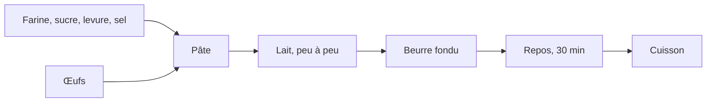

Ce guide détaille les étapes de la feuille du TD 3a, le TD du parcours
standard. Pour chaque étape, il indique le dossier dans lequel se placer, ce
qu'il faut écrire ou taper, et comment vérifier le résultat.

Le TD ajoute une recette, les gaufres, à un dépôt git de recettes. Le dépôt
est créé à partir des quatre recettes du TD 1a. Le texte des gaufres est
livré sans structure : il devient un fichier Markdown, `recette.md`. Le
notebook `pages.ipynb`, livré dans le dossier des recettes, reprend le
programme du TD 1a : il complète chaque recette par le tableau des
ingrédients et la convertit en page HTML. Un commit enregistre chaque
étape.

Le TD reprend la mise en forme en Markdown du TD 3a du cours 1. Le code de
ce guide se copie depuis `guide_3a_markdown.html`, ouvert dans un
navigateur, ou depuis `guide.ipynb`, ouvert dans JupyterLab. Copié depuis le
PDF, il perd ses indentations.

| Étape | Objectif | Ce qu'on fait | Commits à la fin |
|---|---|---|---|
| [0](#étape-0-le-dépôt-des-recettes) | versionner les recettes existantes | copier le dossier des recettes dans `travail/`, l'ouvrir dans VS Code, créer le dépôt | 1 |
| [1](#étape-1-tester-le-notebook-des-pages) | vérifier le programme qui produit les pages | exécuter `pages.ipynb` ; les pages produites restent hors du dépôt | 1 |
| [2](#étape-2-la-recette-des-gaufres-en-markdown) | structurer un texte en Markdown | écrire la recette des gaufres dans un nouveau dossier du dépôt | 1 |
| [3](#étape-3-la-page-des-gaufres-puis-le-commit) | produire la page, versionner la recette | relancer le notebook, committer le dossier `gaufres/` | 2 |
| [4](#étape-4-un-diagramme-mermaid) | modifier un fichier suivi, lire le `diff` | ajouter un diagramme de la préparation, relire la modification, committer | 3 |

## Étape 0 · Le dépôt des recettes

> **À faire :** copier `depart/recettes/` dans `travail/` ; ouvrir `travail/recettes/` dans VS Code, avec un terminal Git Bash ; `git init`, le nom et l'adresse pour ce dépôt, un fichier `.gitignore`, puis le premier commit.
>
> **À obtenir :** `git log --oneline` affiche une ligne ; le panneau du contrôle de code source de VS Code n'affiche aucune modification.

**Dossier de départ** : `cours3/3a_markdown/`, tel que décompressé depuis
l'archive.

```text
3a_markdown/
├── depart/
│   ├── recettes/                    ← le dossier qui deviendra le dépôt
│   │   ├── crepes/
│   │   │   ├── ingredients.csv      ← les quantités pour une personne
│   │   │   └── recette.md
│   │   ├── mousse_chocolat/         (même contenu)
│   │   ├── pate_pizza/              (même contenu)
│   │   ├── salade_lentilles/        (même contenu)
│   │   ├── pages.ipynb              ← le notebook qui produit les pages
│   │   └── style.css                ← la feuille de style des pages
│   ├── gaufres/
│   │   ├── ingredients.csv
│   │   ├── photo.jpg
│   │   └── recette_a_formater.txt   ← le texte de la recette, sans structure
│   ├── recette_attendue.md          ← le résultat attendu, à ouvrir après avoir essayé
│   └── CREDITS.md
└── travail/                         (vide)
```

### 0.1 Copier le dossier et l'ouvrir dans VS Code

Dans l'explorateur de fichiers Windows, copier le dossier `depart/recettes/`
dans `travail/`. Dans VS Code : Fichier → Ouvrir le dossier… → choisir
`3a_markdown/travail/recettes/`, le dossier du futur dépôt. VS Code
affiche l'état git du dossier ouvert, et ses outils git ne fonctionnent que
si le dépôt est ce dossier.

Ouvrir ensuite un terminal Git Bash : menu Terminal → Nouveau terminal ; si
le terminal ouvert n'est pas Git Bash, cliquer sur la flèche à côté du `+`,
en haut à droite du panneau du terminal, puis choisir « Git Bash ».

**Vérification** : dans le terminal, `pwd` affiche un chemin qui se termine
par `3a_markdown/travail/recettes`.

### 0.2 Créer le dépôt

Dans le terminal Git Bash de VS Code, dans `travail/recettes/` :

```text
git init
```

Régler ensuite votre nom et votre adresse pour ce dépôt. Le poste est
partagé : le réglage se fait dans le dépôt, sans `--global`, et ne vaut que
pour lui.

```text
git config user.name "Prénom Nom"
git config user.email "prenom.nom@exemple.fr"
```

**Vérification** : l'icône du contrôle de code source, dans la barre de
gauche de VS Code (raccourci Ctrl+Maj+G), affiche un nombre : les fichiers
du dossier, pas encore suivis.

### 0.3 Le fichier `.gitignore`

`.gitignore` est un fichier texte, placé dans le dossier du dépôt. Chaque
ligne de ce fichier nomme un fichier ou un dossier que git ne suit pas. Son
nom commence par un point et n'a pas d'autre extension.

Le dépôt ne contient que les sources des recettes. Les pages produites par
le notebook, `page.md` et `page.html` dans chaque dossier de recette, n'y
entrent pas : le notebook les refait à chaque exécution. Le notebook
lui-même n'y entre pas non plus : son fichier `.ipynb` contient aussi les
sorties des cellules, qui changent à chaque exécution. `.ipynb_checkpoints/`
est un dossier de sauvegarde que JupyterLab crée à côté du notebook.

1. Créer le fichier vide. Dans le terminal :

   ```text
   touch .gitignore
   ```

2. Ouvrir `.gitignore` dans VS Code, y écrire quatre lignes, puis
   enregistrer. Le fichier contient alors exactement :

   ```text
   page.md
   page.html
   pages.ipynb
   .ipynb_checkpoints/
   ```

   Un nom seul, sans dossier, vaut dans tous les sous-dossiers : `page.md`
   écarte la page de chaque recette.

**Vérification** :

```text
git status
```

liste `.gitignore`, `crepes/`, `mousse_chocolat/`, `pate_pizza/`,
`salade_lentilles/` et `style.css` parmi les fichiers non suivis, mais pas
`pages.ipynb`.

### 0.4 Le premier commit

```text
git add .
git commit -m "Les quatre recettes"
git log --oneline
```

**Vérification** : `git log --oneline` affiche une ligne, avec le message du
commit. Le panneau du contrôle de code source de VS Code n'affiche plus
aucune modification.

## Étape 1 · Tester le notebook des pages

> **À faire :** ouvrir `travail/recettes/pages.ipynb` dans JupyterLab et l'exécuter en entier.
>
> **À obtenir :** une page `page.html` dans chaque dossier de recette ; `git status` n'affiche aucune modification.

Dans JupyterLab, lancé sur le dossier `cours3/` au TD 0a, ouvrir dans le
panneau de gauche `3a_markdown/`, puis `travail/`, puis `recettes/`, et
double-cliquer sur `pages.ipynb`. Exécuter toutes les cellules : menu Run,
puis Run All Cells.

**Vérification** : la dernière cellule affiche une ligne par recette,
`crepes/page.html écrit`, et ainsi de suite. Ouvrir `crepes/page.html` par un
double-clic dans l'explorateur de fichiers : la page affiche « Ingrédients
pour 4 personnes en SI » et le tableau des quantités.

Dans le terminal de VS Code :

```text
git status
```

**Vérification** : « rien à valider, la copie de travail est propre ». Les
pages et le notebook existent dans le dossier, mais `.gitignore` les écarte.

## Étape 2 · La recette des gaufres en Markdown

> **À faire :** créer le dossier `gaufres/` dans le dépôt, y copier les trois fichiers de `depart/gaufres/`, renommer le texte en `recette.md`, puis le mettre en forme en Markdown, l'aperçu ouvert à côté.
>
> **À obtenir :** dans l'aperçu, un grand titre, une ligne en italique, la photo, deux sous-titres, une liste numérotée de six étapes et une citation.

### 2.1 Le dossier de la recette

Dans l'explorateur de fichiers Windows, copier le dossier `depart/gaufres/`
dans `travail/recettes/`. Dans l'explorateur de VS Code, le dossier
`gaufres/` apparaît, avec `ingredients.csv`, `photo.jpg` et
`recette_a_formater.txt`. Clic droit sur `recette_a_formater.txt`, Renommer
(ou `F2`), et le nommer `recette.md`.

Chaque recette du dépôt suit la même organisation : un dossier, un fichier
`recette.md` et un fichier `ingredients.csv`. Le notebook ne traite que les
dossiers qui la suivent.

### 2.2 L'aperçu

Ouvrir `gaufres/recette.md` dans VS Code.

Ouvrir l'aperçu à côté de l'éditeur : `Ctrl` + `K` puis `V`, ou l'icône en
haut à droite de l'éditeur. L'aperçu se met à jour pendant la frappe.


| Raccourci | Ce qu'il ouvre |
|---|---|
| `Ctrl` + `K` puis `V` | l'aperçu à droite ; l'éditeur reste à gauche |
| `Ctrl` + `Maj` + `V` | l'aperçu seul, dans un onglet |

Sur un ordinateur personnel, d'autres éditeurs affichent aussi le Markdown
mis en forme, par exemple Zettlr, logiciel libre, ou Obsidian, gratuit. Sur
les postes de la salle, le TD se fait dans VS Code.

### 2.3 Mettre le texte en forme

Chaque élément du texte reçoit sa marque Markdown. Regarder l'aperçu après
chaque ligne modifiée.

| Élément | Ce qu'on écrit | Exemple |
|---|---|---|
| le titre | `# ` en début de ligne | `# Gaufres` |
| la ligne sous le titre | entre deux `*`, en italique | `*Pour 8 gaufres, …*` |
| les sections | `## ` en début de ligne | `## Ingrédients`, `## Préparation` |
| les étapes | `1. `, `2. `… en début de ligne | `1. Mélanger la farine…` |
| les mots importants | entre deux `**`, en gras | `**peu à peu**` |
| la remarque | `> ` en début de ligne, une citation | `> Les gaufres se servent chaudes…` |

Deux points propres à cette recette :

- **La section `## Ingrédients` reste vide.** Supprimer les lignes des
  ingrédients qui la suivent dans le texte brut. Le notebook `pages.ipynb`
  écrit à cet endroit le tableau des quantités, qu'il lit dans
  `ingredients.csv` et adapte au nombre de personnes.
- **La photo** s'insère sous la ligne en italique, séparée par des lignes
  vides :

  ```text
  
  ```

  Entre crochets, une légende qui décrit l'image ; entre parenthèses, le
  chemin du fichier. Le chemin est relatif : il part du dossier de
  `recette.md`, où est `photo.jpg`.

Enregistrer (`Ctrl` + `S`).

**Vérification** : l'aperçu affiche la photo, et les deux sections sont des
sous-titres, soulignés. `recette_attendue.md`, dans `depart/`, donne le
résultat : l'ouvrir pour comparer, une fois le fichier écrit.

## Étape 3 · La page des gaufres, puis le commit

> **À faire :** relancer `pages.ipynb` ; vérifier la page des gaufres ; committer le dossier `gaufres/`.
>
> **À obtenir :** la page affiche la photo et le tableau des ingrédients ; `git log --oneline` affiche deux lignes.

### 3.1 La page

Dans JupyterLab, dans `pages.ipynb`, exécuter de nouveau toutes les cellules
(Run, puis Run All Cells).

**Vérification** : la dernière cellule affiche aussi
`gaufres/page.html écrit`. Ouvrir `gaufres/page.html` par un double-clic :
la page affiche la photo, le titre « Ingrédients pour 4 personnes en SI » et
le tableau des quantités. Le notebook a traité une recette qu'il n'avait
jamais vue, sans changement de code.

Pour une autre quantité, ajouter une cellule à la fin du notebook, par
exemple `generer_page(RACINE / "gaufres", personnes=8, unites="US")`, puis
recharger la page dans le navigateur.

### 3.2 Le commit

```text
git status
```

**Vérification** : `gaufres/` est listé parmi les fichiers non suivis.

```text
git add gaufres
git commit -m "La recette des gaufres"
git log --oneline
```

**Vérification** : `git log --oneline` affiche deux lignes. `git show
--stat` liste les trois fichiers du commit : `gaufres/ingredients.csv`,
`gaufres/photo.jpg` et `gaufres/recette.md`.

## Étape 4 · Un diagramme Mermaid

> **À faire :** ajouter à `gaufres/recette.md` un diagramme de la préparation, écrit en Mermaid ; relire la modification ; la committer.
>
> **À obtenir :** le diagramme dessiné dans l'aperçu ; `git log --oneline` affiche trois lignes.

Mermaid décrit un diagramme en texte : chaque ligne relie deux étapes par une
flèche, `-->`, et le dessin est calculé à l'affichage. Documentation :
[mermaid.js.org/syntax/flowchart.html](https://mermaid.js.org/syntax/flowchart.html).

### 4.1 Ajouter le diagramme

Dans `gaufres/recette.md`, après la sixième étape de la préparation et avant la
citation, coller le bloc suivant, séparé par une ligne vide avant et après :

````text

````

`flowchart LR` dessine le diagramme de gauche à droite ; chaque étape a une
lettre, et son texte entre crochets. Enregistrer.

**Vérification** : l'aperçu de VS Code dessine le diagramme. La page produite
par pandoc, si on relance le notebook, affiche en revanche le texte du
bloc : pandoc ne dessine pas les diagrammes Mermaid.

### 4.2 Relire la modification

```text
git diff
```

**Vérification** : les lignes du bloc apparaissent en vert, précédées d'un
`+`. Taper `q` pour quitter l'affichage.

La même comparaison s'affiche dans VS Code. Cliquer sur l'icône du contrôle
de code source, dans la barre de gauche (raccourci Ctrl+Maj+G) : le panneau
liste sous « Modifications » les fichiers modifiés depuis le dernier commit,
marqués `M`. Un clic sur `recette.md` ouvre l'éditeur de comparaison : à
gauche le fichier du dernier commit, à droite le fichier modifié. Les lignes
ajoutées sont sur fond vert.


### 4.3 Le troisième commit

```text
git commit -am "Le diagramme de la préparation"
git log --oneline
```

`-a` ajoute les fichiers déjà suivis qui ont été modifiés : pas besoin de
`git add gaufres/recette.md`.

**Vérification** : `git log --oneline` affiche trois lignes.

**Dossier à la fin du TD** :

```text
travail/recettes/
├── .git/                    (caché : le dépôt)
├── .gitignore
├── crepes/
│   ├── ingredients.csv
│   ├── page.html            (produit, ignoré)
│   ├── page.md              (produit, ignoré)
│   └── recette.md
├── gaufres/
│   ├── ingredients.csv
│   ├── page.html            (produit, ignoré)
│   ├── page.md              (produit, ignoré)
│   ├── photo.jpg
│   └── recette.md
├── mousse_chocolat/         (même organisation)
├── pate_pizza/              (même organisation)
├── salade_lentilles/        (même organisation)
├── pages.ipynb              (ignoré)
└── style.css
```

## Ce que le TD fait constater

- Un fichier Markdown est du texte : ses marques se lisent dans l'éditeur, et
  l'aperçu ou pandoc en font un document mis en forme.
- Le programme du TD 1a, repris dans `pages.ipynb`, fonctionne sur une
  recette qu'il n'a jamais vue, pourvu qu'elle suive la même organisation :
  un dossier, `recette.md` avec une section `## Ingrédients`, et
  `ingredients.csv`.
- Un dépôt git ne contient que les sources, ici le texte des recettes et
  leurs données. `.gitignore` en écarte ce que le notebook produit, et le
  notebook lui-même.
