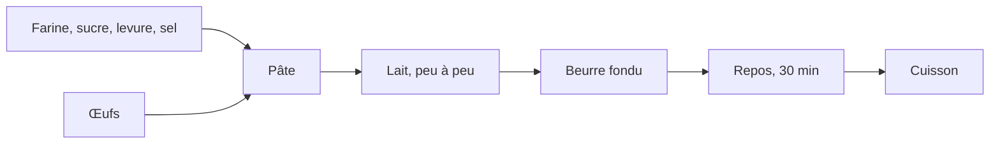

# TD 3b — Une recette en Markdown

Ce guide détaille les étapes de la feuille du TD 3b, le TD du parcours
standard. Pour chaque étape, il indique le dossier dans lequel se placer, ce
qu'il faut écrire ou taper, et comment vérifier le résultat.

Le TD reprend la mise en forme en Markdown du TD 3a du cours 1, sur une
nouvelle recette, les gaufres. Le texte de la recette est livré sans
structure. Il devient un fichier Markdown, `recette.md`, que le programme du
notebook `recette.ipynb` (TD 1a) complète par le tableau des ingrédients et
convertit en page HTML. Le dossier de la recette devient ensuite un dépôt
git, avec un commit par étape.

Le code de ce guide se copie depuis `guide_3b_markdown.html`, ouvert dans un
navigateur, ou depuis `guide.ipynb`, ouvert dans JupyterLab. Copié depuis le
PDF, il perd ses indentations.

| Étape | Ce qu'on fait | Commits à la fin |
|---|---|---|
| [0](#étape-0-préparer-le-dossier-de-la-recette) | copier le dossier de la recette dans `travail/` et l'ouvrir dans VS Code | 0 |
| [1](#étape-1-écrire-la-recette-en-markdown) | écrire `recette.md`, avec l'aperçu ouvert à côté | 0 |
| [2](#étape-2-produire-la-page-avec-le-programme-du-td-1a) | produire la page HTML avec le programme du TD 1a | 0 |
| [3](#étape-3-le-dépôt-de-la-recette) | créer le dépôt de la recette et faire le premier commit | 1 |
| [4](#étape-4-un-diagramme-mermaid) | ajouter un diagramme de la préparation, relire la modification, committer | 2 |

## Étape 0 · Préparer le dossier de la recette

> **À faire :** copier `depart/gaufres/` dans `travail/` ; ouvrir `travail/gaufres/` dans VS Code, avec un terminal Git Bash.
>
> **À obtenir :** l'explorateur de VS Code affiche `ingredients.csv`, `photo.jpg`, `recette_a_formater.txt` et `style.css`.

**Dossier de départ** : `cours3/3b_markdown/`, tel que décompressé depuis
l'archive.

```text
3b_markdown/
├── depart/
│   ├── gaufres/
│   │   ├── ingredients.csv          ← les quantités pour une personne
│   │   ├── photo.jpg                ← la photo de la recette
│   │   ├── recette_a_formater.txt   ← le texte de la recette, sans structure
│   │   └── style.css                ← la feuille de style de la page
│   ├── recette_attendue.md          ← le résultat attendu, à ouvrir après avoir essayé
│   └── CREDITS.md
└── travail/                         (vide)
```

Dans l'explorateur de fichiers Windows, copier le dossier `depart/gaufres/`
dans `travail/`. Dans VS Code : Fichier → Ouvrir le dossier… → choisir
`3b_markdown/travail/gaufres/`. Ouvrir ensuite un terminal Git Bash : menu
Terminal → Nouveau terminal ; si le terminal ouvert n'est pas Git Bash,
cliquer sur la flèche à côté du `+`, en haut à droite du panneau du terminal,
puis choisir « Git Bash ».

**Vérification** : dans le terminal, `pwd` affiche un chemin qui se termine
par `3b_markdown/travail/gaufres`.

## Étape 1 · Écrire la recette en Markdown

> **À faire :** créer `recette.md` avec le texte de `recette_a_formater.txt`, ouvrir l'aperçu à côté, puis mettre le texte en forme.
>
> **À obtenir :** dans l'aperçu, un grand titre, une ligne en italique, la photo, deux sous-titres, une liste numérotée de six étapes et une citation.

### 1.1 Créer le fichier et ouvrir l'aperçu

Dans l'explorateur de VS Code, ouvrir `recette_a_formater.txt`, tout
sélectionner (`Ctrl` + `A`) et copier (`Ctrl` + `C`). Créer ensuite un
nouveau fichier : clic droit dans l'explorateur, « New File… » (« Nouveau
fichier… »), nom `recette.md`. Y coller le texte (`Ctrl` + `V`) et
enregistrer (`Ctrl` + `S`).

Ouvrir l'aperçu à côté de l'éditeur : `Ctrl` + `K` puis `V`, ou l'icône en
haut à droite de l'éditeur. L'aperçu se met à jour pendant la frappe.


| Raccourci | Ce qu'il ouvre |
|---|---|
| `Ctrl` + `K` puis `V` | l'aperçu à droite ; l'éditeur reste à gauche |
| `Ctrl` + `Maj` + `V` | l'aperçu seul, dans un onglet |

Sur un ordinateur personnel, d'autres éditeurs affichent aussi le Markdown
mis en forme, par exemple Zettlr, logiciel libre, ou Obsidian, gratuit. Sur
les postes de la salle, le TD se fait dans VS Code.

### 1.2 Mettre le texte en forme

Chaque élément du texte reçoit sa marque Markdown. Regarder l'aperçu après
chaque ligne modifiée.

| Élément | Ce qu'on écrit | Exemple |
|---|---|---|
| le titre | `# ` en début de ligne | `# Gaufres` |
| la ligne sous le titre | entre deux `*`, en italique | `*Pour 8 gaufres, …*` |
| les sections | `## ` en début de ligne | `## Ingrédients`, `## Préparation` |
| les étapes | `1. `, `2. `… en début de ligne | `1. Mélanger la farine…` |
| les mots importants | entre deux `**`, en gras | `**peu à peu**` |
| la remarque | `> ` en début de ligne, une citation | `> Les gaufres se servent chaudes…` |

Deux points propres à cette recette :

- **La section `## Ingrédients` reste vide.** Supprimer les lignes des
  ingrédients qui la suivent dans le texte brut. Le programme du TD 1a écrit
  à cet endroit le tableau des quantités, qu'il lit dans `ingredients.csv`
  et adapte au nombre de personnes.
- **La photo** s'insère sous la ligne en italique, séparée par des lignes
  vides :

  ```text
  
  ```

  Entre crochets, une légende qui décrit l'image ; entre parenthèses, le
  chemin du fichier. Le chemin est relatif : il part du dossier de
  `recette.md`, où est `photo.jpg`.

Enregistrer (`Ctrl` + `S`).

**Vérification** : l'aperçu affiche la photo, et les deux sections sont des
sous-titres, soulignés. `recette_attendue.md`, dans `depart/`, donne le
résultat : l'ouvrir pour comparer, une fois le fichier écrit.

## Étape 2 · Produire la page avec le programme du TD 1a

> **À faire :** à la fin de `recette.ipynb` (TD 1a), ajouter une cellule qui appelle `generer_page` sur la recette des gaufres.
>
> **À obtenir :** `gaufres.md` et `gaufres.html` dans `travail/gaufres/` ; la page affiche le tableau des ingrédients pour quatre personnes.

Dans JupyterLab, ouvrir le notebook du TD 1a,
`1a_recette/travail/recette.ipynb`. Si le noyau a redémarré depuis le TD 1a,
exécuter de nouveau, dans l'ordre, la cellule des fonctions utiles
(section 1), celle de `generer` (section 3.1), celle de `RACINE`
(section 3.3) et celle de `generer_page` (section 4.3).

Ajouter une cellule à la fin du notebook, et l'exécuter :

```python
# le dossier de la recette des gaufres, dans le TD 3b
GAUFRES = RACINE.parent / "3b_markdown" / "travail" / "gaufres"

generer_page(GAUFRES / "ingredients.csv", GAUFRES / "recette.md", GAUFRES / "gaufres.md")
```

`RACINE` est le dossier `1a_recette/` ; son parent est `cours3/`, qui
contient `3b_markdown/`. `generer_page` écrit la recette complétée,
`gaufres.md`, puis la page, `gaufres.html`, dans le dossier de la recette, à
côté de `photo.jpg` et de `style.css`.

**Vérification** : la cellule affiche les chemins de `gaufres.md` et de
`gaufres.html`. Ouvrir `gaufres.html` par un double-clic dans l'explorateur
de fichiers : la page affiche la photo, le titre « Ingrédients pour 4
personnes en SI » et le tableau des quantités.

Pour une autre quantité, ajouter `personnes=` et `unites=` à l'appel, par
exemple `generer_page(…, personnes=8, unites="US")`, puis recharger la page
dans le navigateur.

## Étape 3 · Le dépôt de la recette

> **À faire :** dans `travail/gaufres/`, `git init`, le nom et l'adresse pour ce dépôt, un fichier `.gitignore`, puis le premier commit.
>
> **À obtenir :** `git log --oneline` affiche une ligne ; `git status` n'affiche ni `gaufres.md` ni `gaufres.html`.

Le dépôt ne contient que la recette : `recette.md`, `ingredients.csv`, la
photo et la feuille de style. Le notebook n'y entre pas : son fichier
`.ipynb` contient aussi les sorties des cellules, et ses modifications se
lisent mal. Les pages produites par le programme n'y entrent pas non plus :
le programme les refait à chaque appel.

### 3.1 Créer le dépôt

Dans le terminal Git Bash de VS Code, dans `travail/gaufres/` :

```text
git init
```

Régler ensuite votre nom et votre adresse pour ce dépôt. Le poste est
partagé : le réglage se fait dans le dépôt, sans `--global`, et ne vaut que
pour lui.

```text
git config user.name "Prénom Nom"
git config user.email "prenom.nom@exemple.fr"
```

### 3.2 Le fichier `.gitignore`

`.gitignore` est un fichier texte, placé dans le dossier du dépôt. Chaque
ligne de ce fichier nomme un fichier ou un dossier que git ne suit pas. Son
nom commence par un point et n'a pas d'autre extension.

1. Créer le fichier vide. Dans le terminal :

   ```text
   touch .gitignore
   ```

2. Ouvrir `.gitignore` dans VS Code, y écrire deux lignes, puis enregistrer.
   Le fichier contient alors exactement :

   ```text
   gaufres.md
   gaufres.html
   ```

**Vérification** :

```text
git status
```

liste `.gitignore`, `ingredients.csv`, `photo.jpg`, `recette.md`,
`recette_a_formater.txt` et `style.css` parmi les fichiers non suivis, mais
ni `gaufres.md` ni `gaufres.html`.

### 3.3 Le premier commit

```text
git add .
git commit -m "La recette des gaufres en Markdown"
git log --oneline
```

**Vérification** : `git log --oneline` affiche une ligne, avec le message du
commit.

## Étape 4 · Un diagramme Mermaid

> **À faire :** ajouter à `recette.md` un diagramme de la préparation, écrit en Mermaid ; relire la modification ; la committer.
>
> **À obtenir :** le diagramme dessiné dans l'aperçu ; `git log --oneline` affiche deux lignes.

Mermaid décrit un diagramme en texte : chaque ligne relie deux étapes par une
flèche, `-->`, et le dessin est calculé à l'affichage. Documentation :
[mermaid.js.org/syntax/flowchart.html](https://mermaid.js.org/syntax/flowchart.html).

### 4.1 Ajouter le diagramme

Dans `recette.md`, après la sixième étape de la préparation et avant la
citation, coller le bloc suivant, séparé par une ligne vide avant et après :

````text

````

`flowchart LR` dessine le diagramme de gauche à droite ; chaque étape a une
lettre, et son texte entre crochets. Enregistrer.

**Vérification** : l'aperçu de VS Code dessine le diagramme. La page produite
par pandoc, si on relance la cellule de l'étape 2, affiche en revanche le
texte du bloc : pandoc ne dessine pas les diagrammes Mermaid.

### 4.2 Relire la modification

```text
git diff
```

**Vérification** : les lignes du bloc apparaissent en vert, précédées d'un
`+`. Taper `q` pour quitter l'affichage.

La même comparaison s'affiche dans VS Code. Cliquer sur l'icône du contrôle
de code source, dans la barre de gauche (raccourci Ctrl+Maj+G) : le panneau
liste sous « Modifications » les fichiers modifiés depuis le dernier commit,
marqués `M`. Un clic sur `recette.md` ouvre l'éditeur de comparaison : à
gauche le fichier du dernier commit, à droite le fichier modifié. Les lignes
ajoutées sont sur fond vert.


### 4.3 Le second commit

```text
git commit -am "Le diagramme de la préparation"
git log --oneline
```

`-a` ajoute les fichiers déjà suivis qui ont été modifiés : pas besoin de
`git add recette.md`.

**Vérification** : `git log --oneline` affiche deux lignes.

**Dossier à la fin du TD** :

```text
travail/gaufres/
├── .git/                    (caché : le dépôt)
├── .gitignore
├── gaufres.html             (produit, ignoré)
├── gaufres.md               (produit, ignoré)
├── ingredients.csv
├── photo.jpg
├── recette.md
├── recette_a_formater.txt
└── style.css
```

## Ce que le TD fait constater

- Un fichier Markdown est du texte : ses marques se lisent dans l'éditeur, et
  l'aperçu ou pandoc en font un document mis en forme.
- Le programme du TD 1a fonctionne sur une recette qu'il n'a jamais vue,
  pourvu qu'elle suive la même organisation : un dossier, `recette.md` avec
  une section `## Ingrédients`, et `ingredients.csv`.
- Un dépôt git ne contient que les sources, ici le texte de la recette et
  ses données. `.gitignore` en écarte ce que le programme produit.
