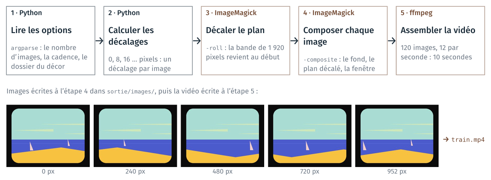
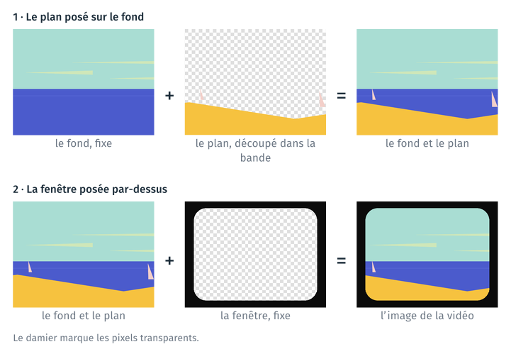
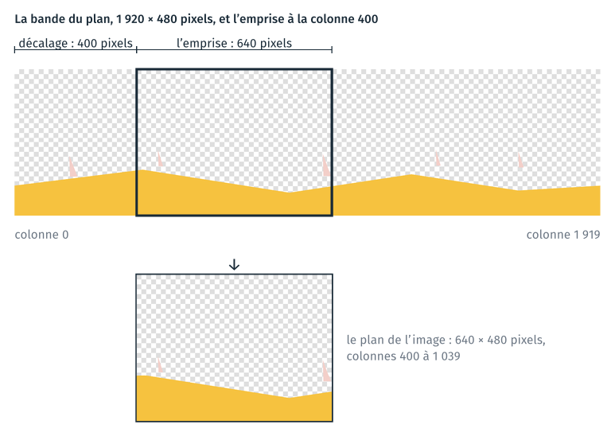
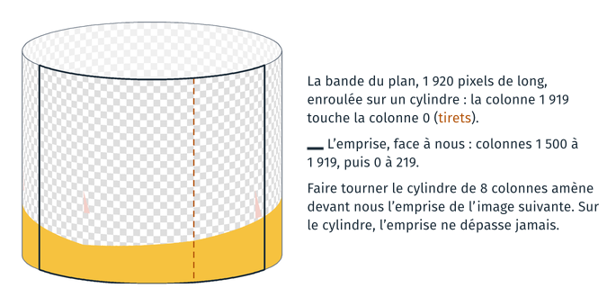
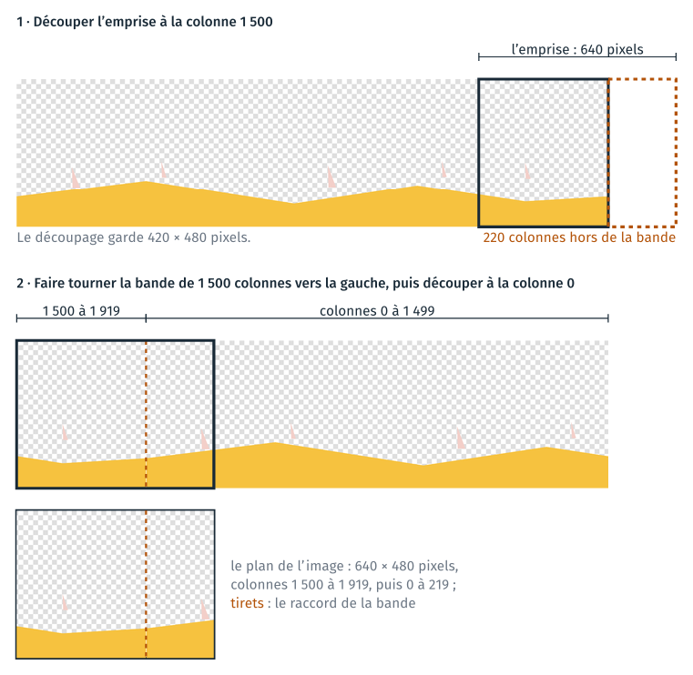
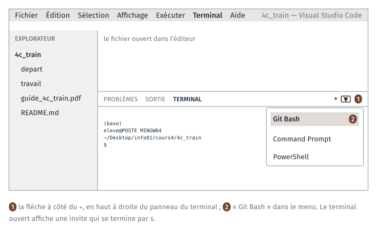
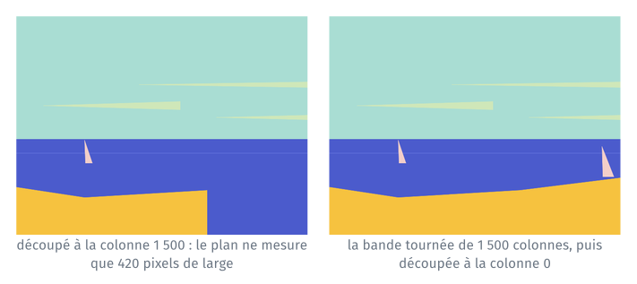
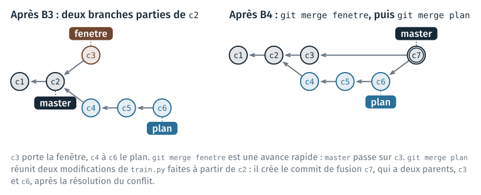
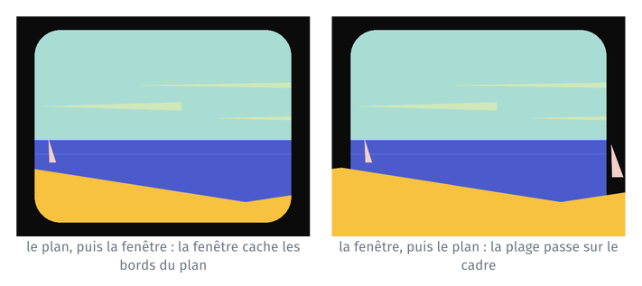
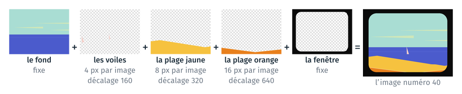

Le TD fabrique une courte vidéo : la mer vue de la fenêtre d'un train, les voiles et la plage qui défilent derrière la vitre, d'après la scène de la mer du clip « Moon » de Kid Francescoli. Le rendu est un projet
Python, versionné avec git, qui contient un script `train.py` appelable en
ligne de commande.

Chaque image de la vidéo superpose trois images du décor : le fond, le plan,
découpé dans une bande plus large que l'image, et la fenêtre. La section « La
méthode », après le tableau des étapes, décrit comment le programme compose
une image, puis la vidéo, avec des schémas.

Le script enchaîne toutes les étapes de la fabrication de la vidéo :

- la fonction `decalages` calcule de combien de pixels le paysage est décalé sur chaque image ; pour chaque décalage, la fonction `image` construit la commande qui compose l'image ;
- ImageMagick (`magick`) compose chaque image : le fond fixe, le plan décalé, puis la fenêtre par-dessus ;
- ffmpeg assemble les images en une vidéo.

ImageMagick et ffmpeg sont des programmes en ligne de commande, comme git
(cours 2) et pandoc (cours 3). Le script les lance avec `subprocess.run`,
une fois par image pour `magick` et une fois à la fin pour `ffmpeg` : Python
automatise ainsi l'ensemble des étapes. Pendant le développement, chaque
étape du TD se termine par un commit git.

Le schéma suivant montre les étapes du script final, avec des images de la
vidéo produite. Il est aussi dans la section 2 du notebook.



Le TD a deux parties.

- **Partie A** (environ 35 minutes) : créer un environnement conda qui
  contient ces outils, puis exécuter le notebook `train.ipynb` qui fabrique la
  vidéo.
- **Partie B** (environ 70 minutes) : construire le programme `train.py`,
  lancé depuis un terminal, en suivant les étapes de la composition : le
  fond, puis la fenêtre et le plan sur deux branches git réunies par une
  fusion, puis la série d'images et la vidéo.

Pour chaque étape, le guide indique le dossier où se placer, les fichiers
au début et à la fin, le code à écrire et l'endroit où l'écrire, les
commandes à taper et la façon de vérifier le résultat.

Le tableau résume les étapes ; chaque nom d'étape renvoie à la page qui la
détaille. Chaque page commence par un encadré qui résume l'étape.

| Étape | Ce qu'on fait | Commits à la fin |
|---|---|---|
| [A1](#a1-récupérer-les-fichiers-du-td-les-ouvrir-dans-vs-code) | récupérer les fichiers du TD | |
| [A2](#a2-rendre-conda-disponible-créer-lenvironnement-animation) | créer l'environnement `animation` | |
| [A3](#a3-activer-lenvironnement-et-vérifier-les-outils) | activer l'environnement et vérifier les outils | |
| [A4](#a4-exécuter-le-notebook-dans-jupyterlab) | exécuter le notebook dans JupyterLab | |
| [B0](#b0-le-dossier-du-projet-et-le-dépôt-git) | créer le dossier du projet et le dépôt git | 1 |
| [B1](#b1-le-fond-sur-master) | le fond, sur `master` | 2 |
| [B2](#b2-la-fenêtre-sur-la-branche-fenetre) | la fenêtre, sur la branche `fenetre` | 3 |
| [B3](#b3-le-plan-sur-la-branche-plan) | le plan, sur la branche `plan` | 6 |
| [B4](#b4-réunir-les-deux-branches-un-conflit) | réunir les deux branches : un conflit à résoudre | 7 |
| [B5](#b5-une-série-dimages-sur-la-branche-serie) | une série d'images, sur la branche `serie` | 9 |
| [B6](#b6-la-vidéo-sur-la-branche-video) | la vidéo, sur la branche `video` | 11 |
| [B7](#b7-le-readme-complet) | le README complet | 12 |
| [B8](#b8-facultative-src-pyproject.toml-et-une-commande-installée) (facultatif) | `src/`, `pyproject.toml`, une commande installée | 13 |
| [Annexe](#annexe-plusieurs-plans-plusieurs-vitesses) | plusieurs plans, plusieurs vitesses | |

## La méthode

Cette section décrit comment le programme fabrique une image de la vidéo,
puis la vidéo, et dans quel ordre la partie B le construit. La section 1 du
notebook reprend les mêmes schémas.

### Composer une image

Chaque image de la vidéo mesure 640 × 480 pixels. Elle est composée de trois
images du décor, posées l'une sur l'autre : le fond, puis le plan, puis la
fenêtre. Le fond contient le ciel, les nuages et la mer ; la fenêtre, un
cadre noir et une vitre transparente. Les deux sont les mêmes sur toutes les
images : seul le plan change d'une image à la suivante. Le damier des
schémas marque les pixels transparents, qui laissent voir l'image placée
dessous.



### Découper le plan dans une bande

Le plan contient les voiles et la plage. Il est dessiné sur une bande de
1 920 × 480 pixels, trois fois plus large qu'une image de la vidéo. Le plan
d'une image est un rectangle de 640 × 480 pixels découpé dans la bande. On
appelle ce rectangle l'emprise. Le décalage est le numéro de la colonne de la
bande où commence l'emprise.



D'une image de la vidéo à la suivante, le décalage augmente de 8 pixels :
l'emprise avance de 8 colonnes vers la droite dans la bande, et les voiles et
la plage se déplacent de 8 pixels vers la gauche dans l'image.

### Faire tourner la bande

L'emprise dépasse le bord droit de la bande dès que le décalage dépasse
1 920 − 640 = 1 280. Avec un décalage de 1 500, le découpage ne garde que les
420 colonnes qui restent dans la bande.

La bande est dessinée pour que son bord droit se raccorde à son bord gauche :
placée après la colonne 1 919, la colonne 0 continue le dessin. Enroulée sur
un cylindre, comme les décors du clip posés sur une table tournante, la
bande n'a plus de bord.



Le programme fait tourner la bande comme le cylindre. Pour un décalage de
1 500, il déplace la bande de 1 500 colonnes vers la gauche ; les colonnes
qui sortent à gauche reviennent à droite. L'emprise est ensuite découpée à
partir de la colonne 0, et ne dépasse plus.



Pour un décalage inférieur à 1 280, faire tourner la bande puis découper à la
colonne 0 donne le même plan que découper à la colonne du décalage. Un
décalage plus grand que la bande fait plus d'un tour : 2 120 donne le même
plan que 200, car 2 120 = 1 920 + 200.

### L'algorithme

Le programme final, `train.py`, fait les opérations suivantes :

1. lire les options : le nombre d'images, la cadence de la vidéo, le dossier
   du décor ;
2. calculer le décalage de chaque image : 0, 8, 16… ;
3. pour chaque décalage, construire la commande `magick` morceau par
   morceau, puis la lancer :
   - le fond ;
   - le plan : faire tourner la bande, découper l'emprise, puis poser le
     plan sur le fond (`-composite`) ;
   - la fenêtre, posée en dernier (`-composite`) ;
   - le nom du fichier à écrire ;
4. assembler les images en une vidéo avec ffmpeg.

Chaque morceau de la commande est une liste d'arguments, renvoyée par une
fonction : `arguments_fond`, `arguments_plan`, `arguments_fenetre`. La
fonction `image` ajoute ces listes l'une après l'autre avec `+`. L'ordre des
morceaux est l'ordre dans lequel `magick` pose les images.

### Construire le programme étape par étape

La partie B construit `train.py` dans l'ordre de la composition : une étape
ajoute une seule fonctionnalité, et se vérifie avant le commit, en ouvrant
l'image écrite et en lisant sa taille.

- B1, le fond : le programme écrit une image qui ne contient que le fond, et
  affiche sa taille, `640x480`.
- B2, la fenêtre : la fenêtre posée sur le fond, sur une branche `fenetre`.
- B3, le plan : le plan posé sur le fond, puis l'option `--decalage`, puis la
  bande qu'on fait tourner, sur une branche `plan`.
- B4, la fusion des deux branches : l'image complète.
- B5 et B6 : la série d'images, puis la vidéo.

La fenêtre et le plan ne dépendent pas l'un de l'autre : ils se développent
sur deux branches parties du même commit, celui du fond, puis se réunissent
par une fusion. Les deux branches modifient la fonction `image` au même
endroit : la fusion s'arrête sur un conflit, que l'étape B4 fait résoudre.

## Rappels

**Un seul outil : VS Code.** Tout le TD se fait dans VS Code :
l'explorateur, à gauche, montre les fichiers ; l'éditeur, au centre,
affiche le fichier ouvert ; le terminal, en bas, sert à taper les
commandes. Le dossier du TD est ouvert à l'étape A1 et reste ouvert jusqu'à
la fin.

**Le terminal Git Bash.** Le terminal est Git Bash, celui du cours 2. Pour
l'ouvrir : menu Terminal → Nouveau terminal. Si le terminal ouvert n'est pas
Git Bash, cliquer sur la flèche à côté du `+`, en haut à droite du panneau
du terminal, puis choisir « Git Bash ».



L'invite de Git Bash tient sur plusieurs lignes : le nom de l'environnement
conda actif entre parenthèses, puis `eleve@POSTE MINGW64` suivi du dossier
courant ; la dernière ligne commence par `$`, et la commande se tape après.
Dans Git Bash, les chemins s'écrivent avec des `/` : `C:\Users` devient
`/c/Users`.

**Changer de dossier.** `pwd` affiche le dossier courant, `ls` liste son
contenu, `cd nom_du_dossier` descend dans un sous-dossier, `cd ..` remonte
d'un niveau. L'[annexe](#annexe-les-commandes-des-deux-terminaux) rappelle ces commandes et leur équivalent
dans le terminal Windows.

**Environnement conda**. Un environnement est un dossier qui
contient un Python et des programmes installés pour un projet. `conda env
create -f environment.yml` le crée à partir d'un fichier qui en donne la
liste ; `conda activate nom` l'active dans le terminal : les commandes
tapées ensuite (`python`, `magick`, `ffmpeg`, `jupyter`) sont celles de cet
environnement.

**Les lignes à modifier.** À partir de l'étape B2, le guide donne en entier
le code d'une fonction nouvelle. Pour une fonction qui existe déjà, il ne
donne que les lignes qui changent, comme dans cet extrait de l'étape B3.3 :

```diff
-  42 def image(fichier, decor):
+     def image(fichier, decor, decalage):
   43     """Une image de la vidéo, 640 × 480 pixels, écrite dans `fichier`."""
   44     commande = [MAGICK] + arguments_fond(decor)
-  45     commande = commande + arguments_plan(decor) + ["-composite"]
+         commande = commande + arguments_plan(decor, decalage) + ["-composite"]
   46     commande = commande + [str(fichier)]
```

Une ligne marquée `-` est à supprimer, une ligne marquée `+` est à ajouter.
Les lignes sans signe ne changent pas et indiquent l'endroit de la
modification. Le signe `…` remplace des lignes qui ne changent pas.

Le nombre qui suit le signe est le numéro de la ligne dans VS Code, quand
les modifications sont faites de haut en bas. Une ligne ajoutée n'a pas de
numéro. Si le fichier n'a pas les mêmes lignes vides que le guide, les
numéros diffèrent de quelques lignes, et les lignes sans signe permettent
de retrouver l'endroit.

Une ligne ajoutée se copie sans le `+` ni les cinq espaces qui le suivent.
Pour plusieurs lignes, les coller dans VS Code, sélectionner leurs six
premiers caractères en rectangle (`Maj+Alt` en faisant glisser la souris),
puis appuyer sur `Suppr`.

**Si une étape de la partie B échoue.** `git status` montre les fichiers
modifiés depuis le dernier commit ; `git restore train.py` remet le fichier
dans l'état du dernier commit.

# Partie A · Exécuter le notebook

## A1 · Récupérer les fichiers du TD, les ouvrir dans VS Code

> **À faire :** copier `info01-cours4.zip` sur le Bureau et le décompresser ; ouvrir le dossier `cours4/4c_train/` dans VS Code ; ouvrir un terminal Git Bash.
>
> **À obtenir :** l'explorateur de VS Code montre `depart/` et `travail/` ; `pwd` se termine par `cours4/4c_train`.

Copier l'archive `info01-cours4.zip` du dossier partagé `formationTemp` sur
le Bureau, dans le dossier `info01`, puis la décompresser (clic droit →
Extraire tout). Ne pas travailler dans le dossier partagé.

Ouvrir VS Code, puis Fichier → Ouvrir le dossier… → choisir
`info01/cours4/4c_train/`. Ouvrir ensuite un terminal Git Bash (voir les
rappels).

**Vérification** : l'explorateur de VS Code montre le contenu du dossier ;
dans le terminal, `pwd` affiche un chemin qui se termine par
`cours4/4c_train`, et `ls` liste `depart`, `travail`, le guide et
`README.md`. Le dossier contient :

```text
4c_train/
├── depart/
│   ├── environment.yml
│   ├── decor/
│   │   ├── fond.png
│   │   ├── plan.png
│   │   ├── fenetre.png
│   │   ├── voiles.png
│   │   ├── plage_jaune.png
│   │   └── plage.png
│   ├── CREDITS.md
│   ├── illustrations/
│   │   └── programme_train.png
│   ├── notebook/
│   │   └── train.ipynb
│   └── modeles/
│       ├── README.md
│       └── pyproject.toml
├── travail/                 (vide)
├── guide_4c_train.pdf      (ce guide)
└── README.md
```

## A2 · Rendre conda disponible, créer l'environnement `animation`

> **À faire :** une fois par poste, rendre `conda` disponible dans Git Bash (`source …` puis `conda init bash`) ; dans `depart/` : `conda env create -f environment.yml`.
>
> **À obtenir :** l'invite commence par `(base)` ; `conda env list` affiche `animation`.

### A2.1 conda dans Git Bash

Git Bash ne connaît pas la commande `conda` au démarrage. Dans le terminal :

```text
source /c/ProgramData/anaconda3/etc/profile.d/conda.sh
conda init bash
```

`source` rend `conda` disponible dans ce terminal. `conda init bash` écrit la
même instruction dans un fichier que Git Bash lit à chaque ouverture : les
terminaux suivants ont `conda` sans rien taper. Cette partie A2.1 ne se fait
qu'une fois par poste.

Fermer le terminal (icône de corbeille, en haut à droite du panneau du
terminal) et en ouvrir un nouveau, Git Bash.

**Vérification** : la première ligne de l'invite est `(base)` ;
`conda --version` affiche `conda 2…`.

Si `source` répond `No such file or directory`, Anaconda est installé dans
un autre dossier du poste. Essayer
`source /c/Users/$USERNAME/anaconda3/etc/profile.d/conda.sh`, ou demander à
l'enseignant.

### A2.2 Le fichier `environment.yml`

Dans l'explorateur de VS Code, cliquer sur `depart/environment.yml` pour
l'afficher :

```yaml
name: animation
channels:
  - conda-forge
dependencies:
  - python=3.12
  - jupyterlab
  - imagemagick
  - ffmpeg
```

`name` est le nom de l'environnement ; `channels` dit où conda télécharge
les paquets ; `dependencies` liste ce qui est installé.

### A2.3 Créer l'environnement

Dans le terminal, depuis le dossier du TD :

```text
cd depart
ls
conda env create -f environment.yml
```

**Vérification** : `ls` liste `environment.yml`. conda calcule ensuite les
paquets à installer, les télécharge et les installe. Cela prend plusieurs
minutes : lire la partie B pendant ce temps. La commande se termine par des
lignes qui indiquent comment activer l'environnement :

```text
# To activate this environment, use
#
#     $ conda activate animation
```

Puis :

```text
conda env list
```

affiche une ligne `animation`, avec le chemin du dossier de
l'environnement.

**Erreurs fréquentes** :

- `EnvironmentFileNotFound` : le terminal n'est pas dans `depart/`.
  Vérifier avec `pwd` et `ls`.
- `CondaValueError: prefix already exists` : l'environnement existe déjà
  (créé par une autre personne sur ce poste, ou lors d'un essai). Passer à
  l'étape A3.
- une erreur de connexion (`CondaHTTPError`) : pas d'accès au réseau.
  Prévenir l'enseignant.

## A3 · Activer l'environnement et vérifier les outils

> **À faire :** `conda activate animation`, puis `magick -version` et `ffmpeg -version`.
>
> **À obtenir :** la première ligne de l'invite est `(animation)` ; les deux versions s'affichent.

Dans le terminal :

```text
conda activate animation
```

**Vérification** : la première ligne de l'invite est `(animation)` au lieu
de `(base)`.

Vérifier que les trois programmes sont ceux de l'environnement :

```text
which python
magick -version
ffmpeg -version
```

**Vérification** :

- `which python` affiche un chemin qui contient `envs/animation` ;
- `magick -version` affiche `Version: ImageMagick 7…` ;
- `ffmpeg -version` affiche `ffmpeg version …`.

Si `magick` répond `command not found`, l'environnement n'est pas actif :
refaire `conda activate animation`.

## A4 · Exécuter le notebook dans JupyterLab

> **À faire :** copier le notebook dans `travail/`, puis `cd travail` et `jupyter lab` ; exécuter le notebook section par section.
>
> **À obtenir :** section 2 : trois chemins dans `envs\animation` ; section 9 : la vidéo.

**Copier le notebook dans `travail/`, puis lancer JupyterLab.** Dans le
terminal, où l'environnement `animation` est actif :

```text
cd ..
cp depart/notebook/train.ipynb travail/
cd travail
jupyter lab
```

JupyterLab est lancé depuis ce terminal, l'environnement `animation` actif :
c'est ainsi que le notebook trouve `magick` et `ffmpeg`. Ne pas le lancer
depuis Anaconda Navigator, qui le lance dans l'environnement `base`.

**Vérification** : le navigateur s'ouvre sur JupyterLab ; s'il ne s'ouvre
pas, copier dans le navigateur l'adresse `http://localhost:8888/lab?token=…`
affichée dans le terminal. Le panneau de gauche de JupyterLab montre
`train.ipynb`. Ce terminal reste occupé par JupyterLab : le fermer arrête
JupyterLab.

**Exécuter.** Double-cliquer sur `train.ipynb`, puis exécuter les cellules
une par une avec `Maj` + `Entrée`, en lisant le texte entre les cellules.

**Vérifications** :

- la première cellule affiche trois chemins qui contiennent
  `envs\animation` (ou `envs/animation`). Si `magick` ou `ffmpeg` vaut
  `None`, JupyterLab n'a pas été lancé depuis l'environnement `animation` :
  fermer JupyterLab, refaire A3 et A4 ;
- la section 1 décrit la composition d'une image, sans code ; les sections 3 à 7 affichent chacune une étape de la composition et la taille de l'image obtenue ;
- la dernière section affiche la vidéo (`train.mp4`, 120 images, 10 secondes) ;
- `travail/produit/` contient les images d'essai, le dossier `images/` et
  la vidéo.

Essayer ensuite de changer les valeurs de la dernière section, comme le
propose le cadre « À essayer » du notebook : ce sont les trois valeurs que
la partie B passera sur la ligne de commande.

Fin de la partie A. Fermer l'onglet du notebook ; JupyterLab peut rester
ouvert.

# Partie B · Du notebook au programme

La partie B construit le programme `train.py` en suivant les étapes de la
composition d'une image (section 1 du notebook), puis la série d'images et
la vidéo :

1. **le fond** (B1), sur `master` : `python train.py` écrit
   `sortie/train.png`, qui ne contient que le fond ;
2. **la fenêtre** (B2), sur la branche `fenetre` : la fenêtre posée sur le
   fond ;
3. **le plan** (B3), sur la branche `plan`, partie du même commit que
   `fenetre` : le plan posé sur le fond, l'option `--decalage`, puis la bande
   qu'on fait tourner ;
4. **la fusion** (B4) : les deux branches sont réunies dans `master`. Elles
   ont modifié toutes les deux la fonction `image` au même endroit : la
   fusion s'arrête sur un conflit, à résoudre comme au TD 4c du cours 2 ;
5. **une série d'images** (B5), sur la branche `serie` ;
6. **la vidéo** (B6), sur la branche `video`.

Les branches `fenetre` et `plan` développent deux fonctionnalités
indépendantes à partir du même commit, comme deux personnes qui travaillent
en même temps sur le même programme. Le programme a une fonction `main` et
lit ses options avec `argparse` dès la première étape (cours 3). Chaque étape
reprend une section du notebook.

## B0 · Le dossier du projet et le dépôt git

> **À faire :** dans un second terminal Git Bash, `conda activate animation` ; créer `travail/train/` avec `environment.yml` et le dossier `decor/`, un `.gitignore` et un README d'une ligne ; `git init`, puis un premier commit.
>
> **À obtenir :** `git log --oneline` affiche une ligne.

**Un nouveau terminal.** Le premier terminal fait tourner JupyterLab. Ouvrir
un second terminal Git Bash (flèche à côté du `+`, puis « Git Bash ») : il
s'ouvre dans le dossier du TD. Y activer l'environnement :

```text
conda activate animation
```

**Vérification** : la première ligne de l'invite est `(animation)`. À refaire
dans chaque nouveau terminal.

**Créer le dossier du projet** et y copier ce dont le programme a besoin :

```text
mkdir travail/train
cp depart/environment.yml travail/train/
cp -r depart/decor travail/train/
cd travail/train
ls
```

**Vérification** : l'invite se termine par `travail/train` ; `ls` liste
`environment.yml` et `decor`. Le dossier apparaît aussi dans l'explorateur
de VS Code.

**Créer le dépôt git** :

```text
git init
git status
```

**Vérification** : `git init` affiche `Initialized empty Git repository`
(ou `Dépôt Git vide initialisé`) ; `git status` liste les fichiers du
dossier sous « Untracked files » (« Fichiers non suivis »). Si `git status`
liste `depart/` ou `travail/`, le dépôt a été créé dans le mauvais dossier :
supprimer le dossier caché `.git` qui vient d'être créé (`rm -rf .git`),
revenir dans `travail/train/` et recommencer.

**Le fichier `.gitignore` et un premier README.** Le programme écrira ses
images et sa vidéo dans un dossier `sortie/` : ces fichiers ne sont pas
versionnés. Le README, d'une ligne pour l'instant, sera complété à l'étape
B7.

```text
echo "sortie/" > .gitignore
echo "# Train" > README.md
git add .
git commit -m "Le projet : environnement, .gitignore et README"
git log --oneline
```

**Vérification** : `git log --oneline` affiche une ligne ; `git status`
affiche « nothing to commit » (« rien à valider »).

**Dossier à la fin de B0** :

```text
travail/train/
├── .git/                (caché : le dépôt)
├── .gitignore
├── README.md
├── decor/               (les images du décor)
└── environment.yml
```

## B1 · Le fond, sur `master`

> **À faire :** créer `train.py` : les fonctions `arguments_fond`, `image` et `taille`, puis `main` ; un commit sur `master`.
>
> **À obtenir :** `python train.py` écrit `sortie/train.png`, le fond seul, et affiche `640x480` ; deux commits.

**Entrée** : la section 3 du notebook. **Sortie** : `python train.py` écrit
`sortie/train.png`, qui ne contient que le fond, et affiche sa taille.

Le fond est la base commune des deux branches des étapes B2 et B3 : il est
écrit directement sur `master`, en un commit.

### B1.1 L'en-tête du fichier

Créer le fichier `train.py` dans `travail/train/` (explorateur de VS Code :
clic droit sur le dossier `train` → Nouveau fichier). Y coller la
description, les imports, les programmes et les chemins :

```python
"""La fenêtre du train : une image, une série d'images ou une vidéo.

Chaque image superpose trois images du décor : le fond, le plan découpé dans
une bande, puis la fenêtre. Python calcule le décalage du plan sur chaque
image et construit la commande d'ImageMagick ; ffmpeg assemble la vidéo.

    python train.py --decalage 200
    python train.py --images 120
    python train.py --images 120 --video --cadence 12 --nettoyer
    python train.py --help

À lancer dans l'environnement `animation` ; le décor est lu dans `decor/`,
les fichiers sont écrits dans `sortie/`, dans le dossier du terminal.
"""

import argparse
import subprocess
from pathlib import Path

# Les programmes
MAGICK = "magick"
FFMPEG = "ffmpeg"

# Les fichiers produits vont dans sortie/, dans le dossier du terminal
SORTIE = Path.cwd() / "sortie"
IMAGES = SORTIE / "images"
```

### B1.2 Les fonctions de l'image

Dessous, coller les trois fonctions de la section 3 du notebook :

```python
# ---- Une image (sections 3 à 7 du notebook) ---------------------------------

def arguments_fond(decor):
    """Les arguments de magick qui lisent le fond, une image de 640 × 480 pixels."""
    return [str(decor / "fond.png")]


def image(fichier, decor):
    """Une image de la vidéo, 640 × 480 pixels, écrite dans `fichier`."""
    commande = [MAGICK] + arguments_fond(decor)
    commande = commande + [str(fichier)]
    subprocess.run(commande, check=True)


def taille(fichier):
    """La largeur et la hauteur de l'image, en pixels, écrites par magick identify : « 640x480 »."""
    resultat = subprocess.run([MAGICK, "identify", "-format", "%wx%h", str(fichier)],
                              capture_output=True, text=True, check=True)
    return resultat.stdout
```

`arguments_fond` renvoie le premier morceau de la commande `magick` : le
chemin du fond. `image` construit la commande morceau par morceau et la
lance ; pour l'instant, elle ne contient que le fond et le fichier à écrire.
`taille` renvoie la largeur et la hauteur d'une image, écrites par `magick
identify`.

### B1.3 La fonction `main`

À la fin du fichier, coller :

```python
# ---- Le programme ------------------------------------------------------------

def main():
    analyseur = argparse.ArgumentParser(description="La fenêtre du train : une image, une série d'images ou une vidéo.")
    analyseur.add_argument("--decor", default="decor", help="le dossier des images du décor (défaut : decor)")
    options = analyseur.parse_args()
    decor = Path(options.decor)
    if not (decor / "fond.png").exists():
        analyseur.error("décor introuvable : " + options.decor)
    SORTIE.mkdir(exist_ok=True)

    # Une image
    fichier = SORTIE / "train.png"
    image(fichier, decor)
    print(fichier, taille(fichier))


# Vrai quand le fichier est lancé par `python`, faux quand il est importé par
# un autre fichier : dans ce cas, main() n'est pas appelé.
if __name__ == "__main__":
    main()
```

L'option `--decor` donne le dossier des images du décor ; sa valeur par
défaut, `decor`, est le dossier copié à l'étape B0. Si ce dossier ne contient
pas `fond.png`, `analyseur.error` affiche un message et arrête le programme.

Enregistrer (`Ctrl+S`). **Vérifications** :

| Commande | Ce qui doit s'afficher |
|---|---|
| `python train.py` | `…/sortie/train.png 640x480` ; ouvrir l'image par un double-clic : le ciel, les nuages et la mer |
| `python train.py --decor absent` | `error: décor introuvable : absent` |
| `python train.py --help` | l'aide du programme et l'option `--decor` |

```text
git add train.py
git commit -m "Le fond : une image de 640 × 480 pixels"
git log --oneline
```

**Vérification** : deux lignes.

## B2 · La fenêtre, sur la branche `fenetre`

> **À faire :** sur une branche `fenetre` : la fonction `arguments_fenetre` et une ligne dans `image` ; un commit.
>
> **À obtenir :** `sortie/train.png` montre la fenêtre posée sur le fond ; trois commits.

**Entrée** : la section 7 du notebook, sans le plan. **Sortie** :
`python train.py` écrit la fenêtre posée sur le fond.

```text
git checkout -b fenetre
git branch
```

**Vérification** : `git branch` affiche `* fenetre` et `master` ; l'étoile
marque la branche courante.

Dans `train.py`, entre la fonction `arguments_fond` et la fonction `image`,
coller :

```python
def arguments_fenetre(decor):
    """Les arguments de magick qui lisent la fenêtre, une image de 640 × 480 pixels."""
    return [str(decor / "fenetre.png")]
```

Puis, dans la fonction `image`, ajouter la ligne de la fenêtre sous la ligne
qui lit le fond :

```diff
   42     """Une image de la vidéo, 640 × 480 pixels, écrite dans `fichier`."""
   43     commande = [MAGICK] + arguments_fond(decor)
+         commande = commande + arguments_fenetre(decor) + ["-composite"]
   45     commande = commande + [str(fichier)]
   46     subprocess.run(commande, check=True)
```

`-composite` pose la dernière image lue, la fenêtre, sur l'image lue avant
elle, le fond : les pixels transparents de la vitre laissent voir le fond.

Enregistrer. **Vérification** : `python train.py` affiche
`…/sortie/train.png 640x480` ; l'image montre le fond derrière la vitre, et
le cadre noir autour.

```text
git commit -am "Fenêtre : la fenêtre posée sur le fond"
```

## B3 · Le plan, sur la branche `plan`

> **À faire :** depuis `master`, une branche `plan` : le plan posé sur le fond, l'option `--decalage`, puis la bande qu'on fait tourner ; un commit chacun.
>
> **À obtenir :** `python train.py --decalage 1500` écrit une image où la plage traverse toute l'image ; six commits.

**Entrée** : les sections 4 à 6 du notebook. **Sortie** :
`python train.py --decalage 200` écrit le plan décalé de 200 pixels, posé
sur le fond, dans `sortie/train_0200.png`.

### B3.1 Une branche partie de `master`

La branche `plan` part du même commit que `fenetre` : revenir d'abord sur
`master`.

```text
git checkout master
git checkout -b plan
```

**Vérification** : dans VS Code, `train.py` n'a plus la fonction
`arguments_fenetre` : le fichier est revenu à l'état du commit de l'étape B1.
Le travail de l'étape B2 est enregistré sur la branche `fenetre`.

### B3.2 Le plan posé sur le fond

Entre la fonction `arguments_fond` et la fonction `image`, coller la
fonction qui découpe l'emprise à la colonne 0 (sections 4 et 6 du notebook) :

```python
def arguments_plan(decor):
    """Les arguments de magick qui lisent la bande du plan et en découpent 640 × 480 pixels à partir de la colonne 0."""
    return ["(", str(decor / "plan.png"),
            "-crop", "640x480+0+0", "+repage", ")"]
```

Puis ajouter la ligne du plan dans `image` :

```diff
   43     """Une image de la vidéo, 640 × 480 pixels, écrite dans `fichier`."""
   44     commande = [MAGICK] + arguments_fond(decor)
+         commande = commande + arguments_plan(decor) + ["-composite"]
   46     commande = commande + [str(fichier)]
   47     subprocess.run(commande, check=True)
```

Enregistrer. **Vérification** : `python train.py` écrit une image où les
voiles et la plage sont posées sur le fond.

```text
git commit -am "Plan : le plan posé sur le fond"
```

### B3.3 L'option `--decalage`

Le décalage est la colonne de la bande où commence l'emprise (section « La
méthode », schéma de l'emprise). `-crop 640x480+400+0` découpe l'emprise à la
colonne 400. Modifier la fonction `arguments_plan`, la fonction `image`, qui
reçoit maintenant le décalage, et la fonction `main` :

```diff
   34
   35
-  36 def arguments_plan(decor):
-  37     """Les arguments de magick qui lisent la bande du plan et en découpent 640 × 480 pixels à partir de la colonne 0."""
+     def arguments_plan(decor, decalage):
+         """Les arguments de magick qui lisent la bande du plan et en découpent 640 × 480 pixels à partir de la colonne `decalage`."""
   38     return ["(", str(decor / "plan.png"),
-  39             "-crop", "640x480+0+0", "+repage", ")"]
+                 "-crop", "640x480+" + str(decalage) + "+0", "+repage", ")"]
   40
   41
-  42 def image(fichier, decor):
+     def image(fichier, decor, decalage):
   43     """Une image de la vidéo, 640 × 480 pixels, écrite dans `fichier`."""
   44     commande = [MAGICK] + arguments_fond(decor)
-  45     commande = commande + arguments_plan(decor) + ["-composite"]
+         commande = commande + arguments_plan(decor, decalage) + ["-composite"]
   46     commande = commande + [str(fichier)]
   47     subprocess.run(commande, check=True)
    …
   59 def main():
   60     analyseur = argparse.ArgumentParser(description="La fenêtre du train : une image, une série d'images ou une vidéo.")
+         analyseur.add_argument("-d", "--decalage", type=int, default=0, help="le décalage du plan d'une image seule, en pixels (défaut : 0)")
   62     analyseur.add_argument("--decor", default="decor", help="le dossier des images du décor (défaut : decor)")
   63     options = analyseur.parse_args()
    …
   68
   69     # Une image
-  70     fichier = SORTIE / "train.png"
-  71     image(fichier, decor)
+         fichier = SORTIE / ("train_" + str(options.decalage).zfill(4) + ".png")
+         image(fichier, decor, options.decalage)
   72     print(fichier, taille(fichier))
   73
```

Le nom du fichier écrit contient le décalage, sur quatre chiffres : deux
décalages donnent deux fichiers, que l'on peut comparer.

Enregistrer. **Vérifications** :

| Commande | Ce qui doit s'afficher |
|---|---|
| `python train.py --decalage 400` | `…/sortie/train_0400.png 640x480` : les voiles et la plage se sont déplacées vers la gauche |
| `python train.py --decalage 1500` | `…/sortie/train_1500.png 640x480` : la plage s'arrête à 420 pixels du bord gauche, le reste de l'image ne montre que le fond |

À 1 500, l'emprise dépasse la bande (notebook, section 1.3) : le découpage
ne garde que 420 × 480 pixels, que `-composite` pose en haut à gauche du
fond.



```text
git commit -am "Plan : l'option --decalage"
```

### B3.4 Faire tourner la bande

La bande se raccorde d'un bord à l'autre : le programme la fait tourner
avant de découper l'emprise (section « La méthode », schémas du cylindre et
de la rotation). Modifier la fonction `arguments_plan` comme dans la
section 5 du notebook :

```diff
   35
   36 def arguments_plan(decor, decalage):
-  37     """Les arguments de magick qui lisent la bande du plan et en découpent 640 × 480 pixels à partir de la colonne `decalage`."""
+         """Les arguments de magick qui lisent la bande du plan, la font tourner de `decalage` colonnes
+         vers la gauche, puis en découpent 640 × 480 pixels à partir de la colonne 0."""
   39     return ["(", str(decor / "plan.png"),
-  40             "-crop", "640x480+" + str(decalage) + "+0", "+repage", ")"]
+                 "-roll", "-" + str(decalage) + "+0",
+                 "-crop", "640x480+0+0", "+repage", ")"]
   42
   43
```

`-roll -1500+0` fait tourner la bande de 1 500 colonnes vers la gauche ;
`-crop 640x480+0+0` découpe ensuite l'emprise à partir de la colonne 0, qui
ne dépasse plus.

Enregistrer. **Vérifications** :

| Commande | Ce qui doit s'afficher |
|---|---|
| `python train.py --decalage 1500` | la plage traverse toute l'image (image de droite du schéma ci-dessus) |
| `python train.py --decalage 200` | `sortie/train_0200.png` |
| `python train.py --decalage 2120` | `sortie/train_2120.png`, identique à `train_0200.png` : 2 120 = 1 920 + 200 |

```text
git commit -am "Plan : faire tourner la bande"
git log --oneline --graph --all
```

**Vérification** : le graphe dessine deux branches parties du commit de
l'étape B1 : `fenetre`, un commit, et `plan`, trois commits.

## B4 · Réunir les deux branches : un conflit

> **À faire :** `git merge fenetre`, puis `git merge plan` ; résoudre le conflit dans `train.py` ; `git add`, puis `git commit --no-edit`.
>
> **À obtenir :** `python train.py --decalage 200` écrit l'image complète ; un commit de fusion ; sept commits.

**Sortie** : sur `master`, `python train.py --decalage 200` écrit l'image
complète : le fond, le plan, puis la fenêtre.



### B4.1 Fusionner `fenetre`

```text
git checkout master
git merge fenetre
```

**Vérification** : git affiche `Fast-forward` : `master` n'a pas avancé
depuis la création de `fenetre`, git déplace `master` sur le commit de la
fenêtre.

### B4.2 Fusionner `plan` : le conflit

```text
git merge plan
```

**Vérification** : git affiche
`CONFLICT (content): Merge conflict in train.py`, puis
`Automatic merge failed; fix conflicts and then commit the result.` La
fusion est en cours : `git status` liste `train.py` sous « Unmerged paths »
(« Chemins non fusionnés »).

Depuis le commit de l'étape B1, les deux branches ont modifié `train.py` au
même endroit : chacune a ajouté une fonction sous `arguments_fond`, et une
ligne sous la ligne qui lit le fond ; la branche `plan` a aussi ajouté le
paramètre `decalage` à `image`. Git réunit seul les modifications qui portent
sur des lignes différentes, comme celles de `main` ; ici, il ne peut pas
choisir, et il écrit les deux versions dans le fichier.

Ouvrir `train.py` dans VS Code. Sous la fonction `arguments_fond`, le fichier
contient :

```python
<<<<<<< HEAD
def arguments_fenetre(decor):
    """Les arguments de magick qui lisent la fenêtre, une image de 640 × 480 pixels."""
    return [str(decor / "fenetre.png")]


def image(fichier, decor):
    """Une image de la vidéo, 640 × 480 pixels, écrite dans `fichier`."""
    commande = [MAGICK] + arguments_fond(decor)
    commande = commande + arguments_fenetre(decor) + ["-composite"]
=======
def arguments_plan(decor, decalage):
    """Les arguments de magick qui lisent la bande du plan, la font tourner de `decalage` colonnes
    vers la gauche, puis en découpent 640 × 480 pixels à partir de la colonne 0."""
    return ["(", str(decor / "plan.png"),
            "-roll", "-" + str(decalage) + "+0",
            "-crop", "640x480+0+0", "+repage", ")"]


def image(fichier, decor, decalage):
    """Une image de la vidéo, 640 × 480 pixels, écrite dans `fichier`."""
    commande = [MAGICK] + arguments_fond(decor)
    commande = commande + arguments_plan(decor, decalage) + ["-composite"]
>>>>>>> plan
```

Entre `<<<<<<< HEAD` et `=======` : la version de `master`, qui vient de
`fenetre` ; entre `=======` et `>>>>>>> plan` : la version de `plan`.

### B4.3 Résoudre : écrire une version qui réunit les deux

L'image complète demande les deux fonctions, le paramètre `decalage` et
les deux lignes : la version qui réunit les deux s'écrit à la main. Remplacer
toutes les lignes, de `<<<<<<< HEAD` jusqu'à `>>>>>>> plan` compris, par :

```python
def arguments_plan(decor, decalage):
    """Les arguments de magick qui lisent la bande du plan, la font tourner de `decalage` colonnes
    vers la gauche, puis en découpent 640 × 480 pixels à partir de la colonne 0."""
    return ["(", str(decor / "plan.png"),
            "-roll", "-" + str(decalage) + "+0",
            "-crop", "640x480+0+0", "+repage", ")"]


def arguments_fenetre(decor):
    """Les arguments de magick qui lisent la fenêtre, une image de 640 × 480 pixels."""
    return [str(decor / "fenetre.png")]


def image(fichier, decor, decalage):
    """Une image de la vidéo, 640 × 480 pixels, écrite dans `fichier`."""
    commande = [MAGICK] + arguments_fond(decor)
    commande = commande + arguments_plan(decor, decalage) + ["-composite"]
    commande = commande + arguments_fenetre(decor) + ["-composite"]
```

La ligne du plan vient avant celle de la fenêtre : `magick` pose les images
dans l'ordre de la commande, et la fenêtre doit être posée en dernier. Les
liens Accept Both Changes (« Accepter les deux modifications ») de VS Code
garderaient les deux versions l'une après l'autre : deux fonctions `image`,
et la fenêtre avant le plan.

Enregistrer, puis vérifier qu'il ne reste aucun marqueur et que le programme
écrit l'image complète :

```text
grep -n "<<<<<<<\|=======\|>>>>>>>" train.py
python train.py --decalage 200
```

**Vérification** : `grep` n'affiche rien ; `sortie/train_0200.png` montre le
fond, le plan, puis la fenêtre : le cadre noir cache les bords du plan. Si
la plage passe sur le cadre, les deux lignes sont dans le mauvais ordre.



### B4.4 Terminer la fusion

```text
git add train.py
git commit --no-edit
git log --oneline --graph --all
```

`git add` marque le conflit comme résolu. `git commit --no-edit` crée le
commit de fusion avec le message proposé par git, `Merge branch 'plan'`.
Tant que la fusion n'est pas terminée, `git merge --abort` remet `master`
dans l'état d'avant `git merge plan`.

**Vérification** : le graphe dessine le commit de fusion, qui a deux
parents ; `git log --oneline` affiche sept lignes.

## B5 · Une série d'images, sur la branche `serie`

> **À faire :** sur une branche `serie` : les fonctions `decalages` et `serie`, puis l'option `--images`, un commit chacun ; fusion dans `master`.
>
> **À obtenir :** une image par décalage dans `sortie/images/` ; neuf commits.

**Entrée** : la fonction `decalages` de la section 8 et la première cellule
de la section 9 du notebook. **Sortie** : `python train.py --images 120`
écrit une image par décalage dans `sortie/images/`.

```text
git checkout -b serie
```

### B5.1 Les fonctions `decalages` et `serie`

Dans `train.py`, entre la fonction `taille` et la ligne
`# ---- Le programme`, coller :

```python
# ---- Une série d'images (sections 8 et 9 du notebook) -----------------------

VITESSE = 8           # le décalage de plus à chaque image, en pixels


def decalages(nombre, vitesse):
    """Le décalage de chaque image : 0, puis `vitesse` pixels de plus à chaque image."""
    liste = []
    for numero in range(nombre):
        liste.append(numero * vitesse)
    return liste


def serie(decor, nombre):
    """`nombre` images, le plan un peu plus décalé à chaque image, dans IMAGES ; renvoie le nombre d'images."""
    IMAGES.mkdir(parents=True, exist_ok=True)
    for ancienne in IMAGES.glob("img_*.png"):
        ancienne.unlink()
    liste = decalages(nombre, VITESSE)
    numero = 0
    for decalage in liste:
        numero = numero + 1
        fichier = IMAGES / ("img_" + str(numero).zfill(4) + ".png")
        image(fichier, decor, decalage)
    return len(liste)
```

Enregistrer. **Vérification** : `python train.py --help` fonctionne comme
avant : les nouvelles fonctions ne sont pas encore appelées.

```text
git commit -am "Série : les fonctions decalages et serie"
```

### B5.2 L'option `--images` dans `main`

Modifier la fonction `main` :

```diff
   96     analyseur.add_argument("-d", "--decalage", type=int, default=0, help="le décalage du plan d'une image seule, en pixels (défaut : 0)")
   97     analyseur.add_argument("--decor", default="decor", help="le dossier des images du décor (défaut : decor)")
+         analyseur.add_argument("-n", "--images", type=int, help="une série : ce nombre d'images, le plan décalé de 8 pixels de plus à chaque image")
   99     options = analyseur.parse_args()
  100     decor = Path(options.decor)
    …
  103     SORTIE.mkdir(exist_ok=True)
  104
- 105     # Une image
- 106     fichier = SORTIE / ("train_" + str(options.decalage).zfill(4) + ".png")
- 107     image(fichier, decor, options.decalage)
- 108     print(fichier, taille(fichier))
+         if options.images is None:
+             # Une image
+             fichier = SORTIE / ("train_" + str(options.decalage).zfill(4) + ".png")
+             image(fichier, decor, options.decalage)
+             print(fichier, taille(fichier))
+         else:
+             # Une série d'images
+             nombre = serie(decor, options.images)
+             print(nombre, "images dans", IMAGES)
  114
  115
```

La nouvelle option n'a pas de valeur par défaut : sans elle,
`options.images` vaut `None`, et le programme écrit une image seule, comme
en B4. Avec elle, il écrit la série.

Enregistrer. **Vérifications** :

| Commande | Ce qui doit s'afficher |
|---|---|
| `python train.py --images 24` | `24 images dans …/sortie/images` |
| `python train.py --decalage 100` | une image seule, comme en B4 |
| `python train.py --help` | l'option `--images` en plus |

```text
git commit -am "Série : l'option --images"
git checkout master
git merge serie
```

**Vérification** : `Fast-forward` ; `git log --oneline` affiche neuf lignes.

## B6 · La vidéo, sur la branche `video`

> **À faire :** sur une branche `video` : `assembler` et les options `--video` et `--cadence`, puis l'option `--nettoyer`, un commit chacun ; fusion dans `master`.
>
> **À obtenir :** `sortie/train.mp4` ; onze commits.

**Entrée** : la seconde cellule de la section 9 du notebook (ffmpeg).
**Sortie** : `python train.py --images 120 --video` écrit `sortie/train.mp4` ;
avec `--nettoyer`, le dossier `sortie/images/` est ensuite supprimé.

### B6.1 La fonction `assembler`, les options `--video` et `--cadence`

```text
git checkout -b video
```

Dans `train.py`, après la fonction `serie`, coller :

```python
# ---- La vidéo (section 9 du notebook, seconde cellule) ----------------------

def assembler(video, cadence):
    """La vidéo à partir des images img_0001.png, img_0002.png… du dossier IMAGES."""
    subprocess.run([FFMPEG, "-y", "-loglevel", "error",
                    "-framerate", str(cadence),
                    "-i", str(IMAGES / "img_%04d.png"),
                    "-c:v", "mpeg4", "-q:v", "3", "-pix_fmt", "yuv420p",
                    str(video)], check=True)
```

Puis modifier la fonction `main` :

```diff
  108     analyseur.add_argument("--decor", default="decor", help="le dossier des images du décor (défaut : decor)")
  109     analyseur.add_argument("-n", "--images", type=int, help="une série : ce nombre d'images, le plan décalé de 8 pixels de plus à chaque image")
+         analyseur.add_argument("--video", action="store_true", help="assemble la série en vidéo (avec --images)")
+         analyseur.add_argument("-c", "--cadence", type=int, default=12, help="images par seconde de la vidéo (défaut : 12)")
  112     options = analyseur.parse_args()
+         if options.video and options.images is None:
+             analyseur.error("--video demande une série : ajouter --images")
  115     decor = Path(options.decor)
  116     if not (decor / "fond.png").exists():
    …
  127         nombre = serie(decor, options.images)
  128         print(nombre, "images dans", IMAGES)
+             # La vidéo
+             if options.video:
+                 video = SORTIE / "train.mp4"
+                 assembler(video, options.cadence)
+                 print(video, ":", nombre, "images à", options.cadence, "images par seconde")
  134
  135
```

`action="store_true"` fait de `--video` une option sans valeur : présente,
elle vaut `True`.

Enregistrer. **Vérifications** :

| Commande | Ce qui doit s'afficher |
|---|---|
| `python train.py --images 24 --video --cadence 6` | `24 images dans …`, puis `…/sortie/train.mp4 : 24 images à 6 images par seconde` |
| `python train.py --video` | `error: --video demande une série : ajouter --images` |

```text
git commit -am "Vidéo : la fonction assembler, les options --video et --cadence"
```

### B6.2 L'option `--nettoyer`

En tête du fichier, ajouter `import shutil` aux imports :

```diff
   15
   16 import argparse
+     import shutil
   18 import subprocess
   19 from pathlib import Path
```

Après la fonction `assembler`, coller :

```python
def nettoyer():
    """Supprime les fichiers intermédiaires : le dossier des images de la série."""
    shutil.rmtree(IMAGES)
```

`shutil.rmtree` supprime un dossier et tout son contenu. Puis modifier la
fonction `main` :

```diff
  116     analyseur.add_argument("--video", action="store_true", help="assemble la série en vidéo (avec --images)")
  117     analyseur.add_argument("-c", "--cadence", type=int, default=12, help="images par seconde de la vidéo (défaut : 12)")
+         analyseur.add_argument("--nettoyer", action="store_true", help="supprime les images de la série une fois la vidéo écrite")
  119     options = analyseur.parse_args()
  120     if options.video and options.images is None:
    …
  134         nombre = serie(decor, options.images)
  135         print(nombre, "images dans", IMAGES)
- 136         # La vidéo
+             # La vidéo, puis les fichiers intermédiaires supprimés si demandé
  137         if options.video:
  138             video = SORTIE / "train.mp4"
  139             assembler(video, options.cadence)
  140             print(video, ":", nombre, "images à", options.cadence, "images par seconde")
+                 if options.nettoyer:
+                     nettoyer()
+                     print("images intermédiaires supprimées")
  144
  145
```

Enregistrer. **Vérification** : `python train.py --images 24 --video --nettoyer`
affiche `images intermédiaires supprimées` ; `sortie/` contient la vidéo, et
`sortie/images/` n'existe plus.

```text
git commit -am "Vidéo : l'option --nettoyer"
git checkout master
git merge video
git log --oneline
```

**Vérification** : `Fast-forward` ; onze lignes.

## B7 · Le README complet

> **À faire :** remplacer le README par le modèle et le compléter ; un commit.
>
> **À obtenir :** douze commits.

Remplacer `README.md` par le modèle `depart/modeles/README.md` :

```text
cp ../../depart/modeles/README.md README.md
```

L'ouvrir dans VS Code et remplacer chaque passage « (À compléter …) » :

- une phrase qui dit ce que fait le programme ;
- comment récupérer le dossier (archive ou `git clone`) ;
- pour chacune des trois fonctionnalités, une image, une série d'images et
  une vidéo, la commande et ce qu'elle écrit dans `sortie/` ;
- votre nom.

**Vérification** : `Ctrl+Maj+V` affiche l'aperçu. Chaque commande du README
fonctionne quand on la colle dans le terminal, depuis `travail/train/`,
l'environnement `animation` actif.

```text
git commit -am "README complet"
git log --oneline
```

**Vérification** : douze lignes, le commit de fusion compris.

**Dossier à la fin de B7** (fin du TD obligatoire) :

```text
travail/train/
├── .git/
├── .gitignore
├── README.md
├── environment.yml
├── train.py
├── decor/               (les images du décor)
└── sortie/              (non versionné)
```

## B8 (facultative) · `src/`, `pyproject.toml` et une commande installée

> **À faire :** `git mv train.py src/train.py` ; `pyproject.toml` ; `pip install -e .` ; un commit.
>
> **À obtenir :** la commande `train` fonctionne depuis n'importe quel dossier ; treize commits.

**Sortie** : une commande `train`, utilisable dans n'importe quel dossier,
l'environnement `animation` actif, sans écrire `python` ni le chemin du
fichier.

**Déplacer le code dans `src/`** :

```text
mkdir src
git mv train.py src/train.py
git status
```

**Vérification** : `git status` affiche un renommage (`renamed:`). Le
programme écrit dans `sortie/` du dossier du terminal : il n'y a rien à
changer dans le code.

**Le fichier `pyproject.toml`.** Le copier depuis les modèles, puis
compléter la ligne `description` dans VS Code :

```text
cp ../../depart/modeles/pyproject.toml .
```

La partie à lire est :

```toml
[project.scripts]
train = "train:main"
```

La commande `train` appelle la fonction `main` du fichier `train.py`, cherché
dans `src/`.

**Installer** (dans `travail/train/`, l'environnement `animation` actif) :

```text
pip install -e .
```

**Vérification** : la dernière ligne est `Successfully installed train-0.1`.
Si l'installation échoue faute de réseau :
`pip install -e . --no-build-isolation`.

**Utiliser la commande** :

```text
cd ..
train --decor train/decor --decalage 200
train --help
```

**Vérification** : l'image est écrite dans `travail/sortie/train_0200.png` ;
l'aide s'affiche sans `python`.

**Le commit.** Revenir dans `travail/train/` (`cd train`). Dans le README,
remplacer `python train.py` par `train` et ajouter la ligne d'installation
`pip install -e .`.

```text
git add .
git commit -m "src/ et pyproject.toml : la commande train"
git log --oneline
```

**Vérification** : treize lignes. `pip uninstall train` retire la commande.

## Annexe · Plusieurs plans, plusieurs vitesses

Cette annexe ne fait pas partie du TD : elle décrit une suite possible du
programme, sans guide pas à pas.

Dans le clip, les voiles, la plage jaune et la plage orange du premier plan
défilent à des vitesses différentes : plus un plan est proche de la fenêtre,
plus il défile vite. Le ciel, les nuages et la mer ne bougent pas. Le
programme du TD n'a qu'un plan, les voiles et la plage jaune sur la même
bande, qui avancent de 8 pixels par image.

Le dossier `decor/` contient les bandes qu'il faut pour séparer les plans :
`voiles.png`, `plage_jaune.png`, et `plage.png`, la plage orange. Chaque plan
a sa vitesse, en pixels par image. Sur l'image numéro `n`, un plan de vitesse
`v` est décalé de `n × v` pixels. Les plans sont posés du plus lointain au
plus proche, puis la fenêtre.



La commande `magick` se construit comme dans le TD, avec un morceau par
plan. `arguments_plan` reçoit en plus le nom du fichier de la bande ; `image`
reçoit le numéro de l'image, et ajoute les morceaux dans une boucle :

```python
# Les plans, du plus lointain au plus proche : le fichier, et la vitesse en pixels par image
PLANS = [("voiles.png", 4), ("plage_jaune.png", 8), ("plage.png", 16)]


def arguments_plan(decor, nom, decalage):
    """Les arguments de magick qui lisent la bande `nom`, la font tourner de `decalage` colonnes
    vers la gauche, puis en découpent 640 × 480 pixels à partir de la colonne 0."""
    return ["(", str(decor / nom),
            "-roll", "-" + str(decalage) + "+0",
            "-crop", "640x480+0+0", "+repage", ")"]


def image(fichier, decor, numero):
    """L'image numéro `numero` : le fond, chaque plan décalé de numero × sa vitesse, puis la fenêtre."""
    commande = [MAGICK] + arguments_fond(decor)
    for nom, vitesse in PLANS:
        commande = commande + arguments_plan(decor, nom, numero * vitesse) + ["-composite"]
    commande = commande + arguments_fenetre(decor) + ["-composite"]
    commande = commande + [str(fichier)]
    subprocess.run(commande, check=True)
```

Le reste du programme change peu. `serie` passe à `image` le numéro de
chaque image, de 0 à `nombre - 1`, à la place du décalage : la fonction
`decalages` n'est plus utile. Pour une image seule, l'option `--decalage`
devient un numéro d'image.

La vitesse de chaque plan se règle en changeant la liste `PLANS`. Un
quatrième plan demande une bande de 1 920 × 480 pixels de plus dans
`decor/`, et une ligne de plus dans la liste. Le TD 7 reprendra ce programme et
lui ajoutera un autre effet : les ombres des poteaux, qui passent devant la
fenêtre.

## Annexe · Les commandes des deux terminaux

Le TD se fait dans **Git Bash**, le terminal bash installé avec git et
utilisé au cours 2. La colonne de gauche donne les mêmes commandes dans le
terminal Windows (`cmd`, invite de commandes d'Anaconda), pour qui l'utilise ailleurs. Le
terminal de VS Code ouvre l'un ou l'autre (flèche à côté du `+` du panneau
du terminal).

| Pour… | Invite de commandes d'Anaconda (`cmd`) | Git Bash (`bash`) |
|---|---|---|
| afficher le dossier courant | `cd` | `pwd` |
| lister le dossier courant | `dir` | `ls` |
| descendre dans un dossier | `cd travail` | `cd travail` |
| remonter d'un niveau | `cd ..` | `cd ..` |
| créer un dossier | `mkdir montre` | `mkdir montre` |
| copier un fichier | `copy depart\environment.yml travail\` | `cp depart/environment.yml travail/` |
| copier un dossier | `xcopy /E /I depart\recettes travail\recettes` | `cp -r depart/recettes travail/` |
| afficher un fichier texte | `type README.md` | `cat README.md` |
| créer un fichier vide | `type nul > .gitignore` | `touch .gitignore` |
| supprimer un fichier | `del essai.txt` | `rm essai.txt` |
| effacer l'écran | `cls` | `clear` |
| écrire un chemin | `C:\Users\moi\Desktop` | `/c/Users/moi/Desktop` |
| activer un environnement | `conda activate animation` | `conda activate animation`, une fois l'étape A2.1 faite |
| lancer git | `git status`, si git est installé pour tout le poste | `git status` |

**conda dans Git Bash** (étape A2.1). Sur les postes de la salle, Anaconda
est installé dans `C:\ProgramData\anaconda3` :

```text
source /c/ProgramData/anaconda3/etc/profile.d/conda.sh
conda init bash
```

Sur un autre ordinateur, le chemin est celui du dossier d'installation
d'Anaconda : taper `echo %CONDA_PREFIX%` dans l'invite de commandes d'Anaconda pour le
trouver. Dans Git Bash, `C:\` s'écrit `/c/` et les `\` deviennent des
`/`.
